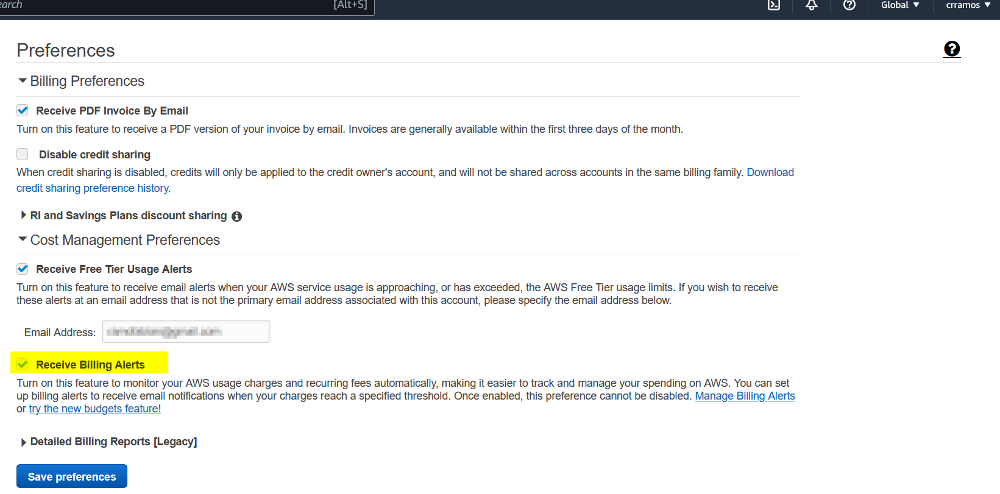
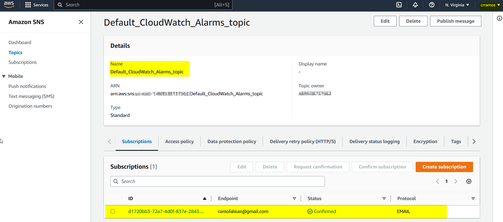

# Week 0 — Billing and Architecture

## Required Homework/Tasks
### Watched Week 0 - Live Streamed Video
:white_check_mark: I was present during the live trasmisstion [Link to video](https://www.youtube.com/watch?v=SG8blanhAOg&list=PLBfufR7vyJJ7k25byhRXJldB5AiwgNnWv&index=12)

Please find below some notes that I have taken from the video:
#### Bussines use case of the project
At the end of the course we will have implemented a new social media called Cruddur, which is an ephemral social network where the users can post, share temporal messages and at the same time bring the user th posibility of monetize the content that has been creted. During this time, we will be using all concepts learned during the lenssons to carry on the works by using AWS services, Github and Gitpod mainly. 

This platform will be using the architecture of microservices which helps to reuse services and code scalling. Where JavaScript + React will be used for frontend and Python + React will be used for backend, regarding databses it might be using SQL or NOSQL DB, the system will have its own NFQDN and security polcies will be implemented to protect the pplatform and users.

There are 2 types of application archtecture:
* Monolitic: In this the archtecture there is only one application that centralices all the works and the system relays only in it. There is no separated services for each function.
* Microservices: It realys on a series of services deployable which acomplish specific functions or goals and the can be updated, tested, deployed and scaled. it reduces the complexity of the solution. It rellays on the stack below: 
<table>
    <tr>
        <td>User Unit</td>
    </tr>
    <tr>
        <td>Bussines logistics</td>
    </tr>
    <tr>
        <td>Data access</td>
    </tr>
</table>
The Iron triangle is a model that should be taken in account to manage the project correctly, it helps to keep the balance and carry on the proyect by undrestanding the strengs and willness of the project. The triagle is based on 3 pilars: scope, cost and time.
<p align="center"></p>

* Scope: Comprehence the features and funtionality (example.new service).
* Cost: Comprehence the budget and resource. (example. how much does it cost? and there is the enough resources?).
* Time: Comprehence the Schdule. (example: how long it will take based on complxity of the tasks, budget and resources?).

With the help of this diagram, we can unserstand the efect will have any action taken during the project and how it can be mitigated.

#### C4 Model
It's a model used to create set of architecture diagramas at work by using the 4C's: System context diagrams, Container diagrams,  Component diagrams and Code. Each of them is a different draw that brings different description levels of the achitecture to buid.
* System context diagrams :arrow_right: It provides the overal system context where there are reactangles and others types of shapes which represents each element of the architecture and their interaction (without going into the detail because the goal to achieve is non technical people can understand your idea)
* Container diagram :arrow_right: It contains the individual service or application by providing high level of tecnology information based on the diagrams (example: protocols, databases, API, micro services, etc). The target in this diagram are developers and software architecters withing or out the team.
* Component diagram :arrow_right: This diagram describes with more detail the information placed in container diagram, it will show the components that made the container up. The target udience are developers and software architects.
* Code :arrow_right: The detailed information of each component and how implement it, its the information that will be find here. Usually UML diagrams are builded here do describe the information.

#### Cloud architecture
* A good architecture of a cloud should have:
    * Clear vocabulary :arrow_right: Understand customer needs.
    * The requirements should be measurable.
    * The objective should be verfible.
    * The requirements should be monitoreable.
    * Clear undertanding about what can be truncable or feastable.
    * Address risk, assumptions and constrains.
* Dising phases:
    * Conceptual desing :arrow_right: first idea.
    * Logical desing :arrow_right: General information.
    * Physical desing  :arrow_right: Actual desing with real inforamtion.
* Tips from RRACs:
    * Ask dummy questions :arrow_right: This is to have the clearest view as possible.
    * Play be the packet :arrow_right: Recreating the possible scenarios will allow the designer reduce the range of failures in the future.
    * Document everything :arrow_right: Don't miss anything.
* TOGAF:
    * Framework for cloud architecture.
    * It maches within AWS services.
    * It brings the vocabulary to work as cloud achitector.
    * The most populat framework for EA.
* [Course diagram](https://lucid.app/lucidchart/6f80cd2d-7d18-4731-aadc-bdda9773c092/edit?invitationId=inv_c648fee2-f691-443d-8602-7e959b41a18d&page=u~1sbYNXU9q3#)

### Watched Chirag's Week 0 - Spend Considerations	
:white_check_mark: DONE, I watched the video, executed the works address by the instructor and summited the quiz without any issue. [Link to video](https://www.youtube.com/watch?v=OVw3RrlP-sI&list=PLBfufR7vyJJ7k25byhRXJldB5AiwgNnWv&index=13)

### Watched Ashish's Week 0 - Security Considerations
:white_check_mark: DONE, I watched the video, executed the works address by the instructor and summited the quiz without any issue. [Link to video](https://www.youtube.com/watch?v=4EMWBYVggQI&list=PLBfufR7vyJJ7k25byhRXJldB5AiwgNnWv&index=15)

### Recreate Conceptual Diagram in Lucid Charts or on a Napkin
:white_check_mark: DONE, I didn't have problems to recreate the chart. 

Find the link to chart file :point_right: [Link to Lucid charts file](https://lucid.app/lucidchart/aea4dfd7-f680-4c1a-99b9-1abad176d570/edit?viewport_loc=-311%2C-84%2C3840%2C1554%2C0_0&invitationId=inv_5bded0c2-5dd1-4840-b55c-264de7306582)

Here it is my napking desing:
<p align="center"></p>

### Recreate Logical Architectual Diagram in Lucid Charts
:white_check_mark: DONE, I didn't have problems to recreate the diagram. 

Find the link to chart file :point_right: [Link to Lucid charts file](https://lucid.app/lucidchart/aea4dfd7-f680-4c1a-99b9-1abad176d570/edit?viewport_loc=-104%2C-36%2C3840%2C1554%2CjF0wpWsibGvK&invitationId=inv_5bded0c2-5dd1-4840-b55c-264de7306582)

<p align="center"></p>

### Create an Admin User
:white_check_mark: DONE, I didn't have problems to create my admin user.

Here there is the prove to the created user called "cristianramos"
<p align="center"></p>

This user was created on Feb 13th and it has assigned the policy "Administratoraccess" as is stated in the picture below:

<p align="center"></p>

### Use CloudShell
:white_check_mark: DONE, I didn't have problems launch and use the cloudshell from root and admin user account.  

In the picture below I was able to execute the commands from CloudShell: "aws sts get-caller-identity" and "aws account get-contact-information": 

<p align="center"></p>

### Generate AWS Credentials
:white_check_mark: DONE, I did almost all without any problem. However my blocking point was the problems at moment to make the push to Github, because I didn't set correctly the permissions between Gitpod and Github. When I realized about it, I fixed it and the push started to work.

The access key generated:
<p align="center"></p>

The access keys exported to env in linux:
<p align="center"></p>

Showing the status of the keys:
<p align="center"></p>

Access keys stored on Gitpod:
<p align="center"></p>

### Installed AWS CLI
:white_check_mark: DONE, I didn't have problems to install and launch and use AWS CLI from Windows or Linux.

Here you can find the proves that I installed the AWS CLI for windows from .msi file:
<p align="center"></p>

Then I configured my access key:
<p align="center"></p>

And here there is the results:
<p align="center"></p>

### Create a Billing Alarm
:white_check_mark: DONE, I didn't have problems to create the Billing alarm.

Enbaling billing alerts:
<p align="center"></p>

SNS configuration:
<p align="center"></p>

Created billing alarm:
<p align="center"></p>

### Create a Budget	
:white_check_mark: DONE, I didn't have problems to create the Budget of 10 USD.

Budget configuration:
<p align="center"></p>

## Homework chanllenges
### 1. Destroy your root account credentials, Set MFA, IAM role
:white_check_mark: DONE,  I didn't have problems to set the MFA, IAM role.

#### NFA set for root and admin user account:
<p align="center"></p>

#### New IAM role set called "AdminRole_bootcamp":
Role summary:
<p align="center"></p>

Role configuration:
<p align="center"></p>

### 2. Use EventBridge to hookup Health Dashboard to SNS and send notification when there is a service health issue.
:white_check_mark: DONE, I was strugguling on this task because there is may ways to do it and at the first attepmt I failed becuase I wasn't adding the right aws service to be monitored and the correct target for SNS. When I found my mistake I fixed and configure it correctly, it was a good taks I learned a lot.

Please find below the rule create  as "Monitor_health_issues" under "default" buses which is the only free tier and the aws pattern as "aws.health":
<p align="center"></p>

Here belo you will find the tagets created to store and monitor the logs events and send the sns notifications:
<p align="center"></p>

### 4. Review all the questions of each pillars in the Well Architected Tool (No specialized lens)
There are 6 pilars of the AWS well architected framework:
#### :sparkle:Operational excellence
This pilar provides an overwiew of design principles and best pratices to support deployment and workload efectily. It offers 4 best parctice areas which are mentioned below:
##### :arrow_right:Organization
Those questions address you to understand if you are hadnling correcly your prioritys, evalute the structure your organizzation in terms of support for bussines outcomes.
```	
OPS 1 > How do you determine what your priorities are? 
OPS 2 > How do you structure your organization to support your business outcomes?
OPS 3 > How does your organizational culture support your business outcomes?
```
##### :arrow_right:Prepare
Those questions help you to know if your desing is well prepared to be easy to be understandable, relayable and scalable.
```
OPS 4  How do you design your workload so that you can understand its state?
OPS 5  How do you reduce defects, ease remediation, and improve flow into production?
OPS 6  How do you mitigate deployment risks?
OPS 7  How do you know that you are ready to support a workload?
```
##### :arrow_right:Operate
Those questions help you to understand if your desing is well cosolidated to be operative and support events.
```
OPS 8  How do you understand the health of your workload?
OPS 9  How do you understand the health of your operations?
OPS 10  How do you manage workload and operations events?
```
##### :arrow_right:Evolve
Those questions help you to understand impact of your solution in the customer bussines.
```
OPS 11  How do you evolve operations?
```
#### :sparkle:Security
This pillar focus on data protection, systems and check your desing elements to improve the security in your desing. It has 6 best practice areas mentioned below:
##### :arrow_right:	Security foundations
This question open the space to analize and comprehence your workload in your desing and how it can be secured.
```
SEC 1  How do you securely operate your workload?
```
##### :arrow_right:	Identity and access management
This questions will help you with access managament for people and machines/services within and outside of your organization.
```   
SEC 2  How do you manage authentication for people and machines?
SEC 3  How do you manage permissions for people and machines?
```
##### :arrow_right:	Detection
```
SEC 4  How do you detect and investigate security events?
```
##### :arrow_right:	Infrastructure protection
```
SEC 5  How do you protect your network resources?
SEC 6  How do you protect your compute resources?
```
##### :arrow_right:	Data protection
```
SEC 7  How do you classify your data?
SEC 8  How do you protect your data at rest?
SEC 9  How do you protect your data in transit?
```
##### :arrow_right:	Incident response
```
SEC 10  How do you anticipate, respond to, and recover from incidents?
```
Reliability
	Foundations
	REL 1  How do you manage service quotas and constraints?
	REL 2  How do you plan your network topology?

	Workload architecture
	REL 3  How do you design your workload service architecture?
	REL 4  How do you design interactions in a distributed system to prevent failures?
	REL 5  How do you design interactions in a distributed system to mitigate or withstand failures?

	Change management
	REL 6  How do you monitor workload resources?
	REL 7  How do you design your workload to adapt to changes in demand?
	REL 8  How do you implement change?

	Failure management
	REL 9  How do you back up data?
	REL 10  How do you use fault isolation to protect your workload?
	REL 11  How do you design your workload to withstand component failures?
	REL 12  How do you test reliability?
	REL 13  How do you plan for disaster recovery (DR)?

Performance efficiency
	Selection
	PERF 1  How do you select the best performing architecture?
	PERF 2  How do you select your compute solution?
	PERF 3  How do you select your storage solution?
	PERF 4  How do you select your database solution?
	PERF 5  How do you configure your networking solution?

	Review
	PERF 6  How do you evolve your workload to take advantage of new releases?

	Monitoring
	PERF 7  How do you monitor your resources to ensure they are performing?

	Tradeoffs
	PERF 8  How do you use tradeoffs to improve performance?

Cost optimization
	Practice Cloud Financial Management
	COST 1  How do you implement cloud financial management?

	Expenditure and usage awareness
	COST 2  How do you govern usage?
	COST 3  How do you monitor usage and cost?
	COST 4  How do you decommission resources?

	Cost-effective resources
	COST 5  How do you evaluate cost when you select services?
	COST 6  How do you meet cost targets when you select resource type, size and number?
	COST 7  How do you use pricing models to reduce cost?
	COST 8  How do you plan for data transfer charges?

	Manage demand and supply resources
	COST 9  How do you manage demand, and supply resources?

	Optimize over time
	COST 10  How do you evaluate new services?

Sustainability
	Region selection
	SUS 1 How do you select Regions to support your sustainability goals?

	User behavior patterns
	SUS 2 How do you take advantage of user behavior patterns to support your sustainability goals?

	Software and architecture patterns
	SUS 3 How do you take advantage of software and architecture patterns to support your sustainability goals?

	Data patterns
	SUS 4 How do you take advantage of data access and usage patterns to support your sustainability goals?

	Hardware patterns
	SUS 5 How do your hardware management and usage practices support your sustainability goals?

	Development and deployment process
	SUS 6 How do your development and deployment processes support your sustainability goals?
### 5. Create an architectural diagram (to the best of your ability) the CI/CD logical pipeline in Lucid Charts
### 6. Research the technical and service limits of specific services and how they could impact the technical path for technical flexibility. 
### 7. Open a support ticket and request a service limit


