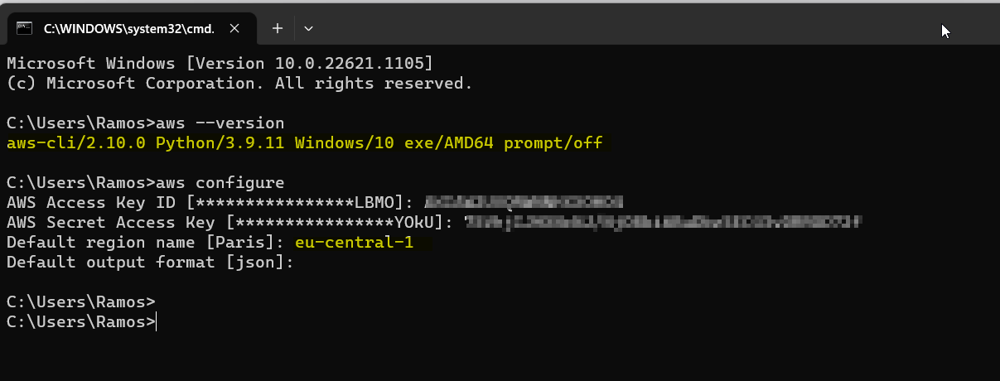
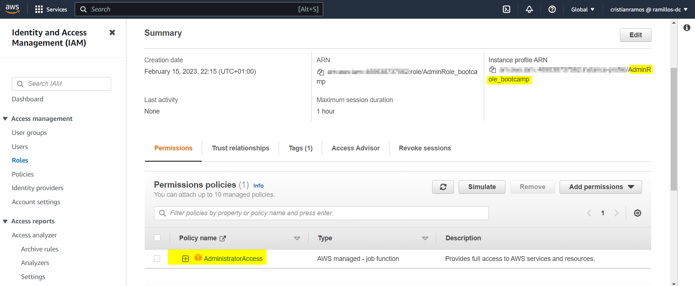

# Week 0 — Billing and Architecture

## Required Homework/Tasks
### Watched Week 0 - Live Streamed Video
:white_check_mark: I was present during the live transmission  [Link to video](https://www.youtube.com/watch?v=SG8blanhAOg&list=PLBfufR7vyJJ7k25byhRXJldB5AiwgNnWv&index=12)

Please find below some notes that I have taken from the video:
#### Business use case of the project
At the end of the course we will have implemented a new social media called Cruddur, which is an ephemeral social network where the users can post, share temporal messages and at the same time bring the user the possibility of monetize the content that has been created. During this time, we will be using all concepts learned during the lessons to carry on the works by using AWS services, Github and Gitpod mainly. 

This platform will be using the architecture of microservices which helps to reuse services and code scaling. Where JavaScript + React will be used for frontend and Python + React will be used for backend, regarding databases it might be using SQL or NOSQL DB, the system will have its own NFQDN and security policies will be implemented to protect the platform and users.

There are 2 types of application architecture:
* Monolithic: In this the architecture there is only one application that centralizes all the works and the system relays only in it. There is no separated services for each function.
* Microservices: It relays on a series of services deployable which accomplish specific functions or goals and the can be updated, tested, deployed and scaled. it reduces the complexity of the solution. It relays on the stack below: 
<table>
    <tr>
        <td>User Unit</td>
    </tr>
    <tr>
        <td>Bussines logistics</td>
    </tr>
    <tr>
        <td>Data access</td>
    </tr>
</table>
The Iron triangle is a model that should be taken in account to manage the project correctly, it helps to keep the balance and carry on the project by understanding the strengths and weaknesses of the project. The triangle is based on 3 pillars: scope, cost and time.
<p align="center"></p>

* Scope: Comprehends the features and functionality (Example: new service).
* Cost: Comprehends the budget and resource. (Example: how much does it cost? and there is the enough resources?).
* Time: Comprehends the Schedule. (Example: how long it will take based on complexity of the tasks, budget and resources?).

With the help of this diagram, we can understand the effect will have any action taken during the project and how it can be mitigated.

#### C4 Model
It's a model used to create set of architecture diagrams at work by using the 4C's: System context diagrams, Container diagrams,  Component diagrams and Code. Each of them is a different draw that brings different description levels of the architecture to build.
* System context diagrams :arrow_right: It provides the overall system context where there are rectangles and other types of shapes which represents each element of the architecture and their interaction (without going into the detail because the goal to achieve is non-technical people can understand your idea)
* Container diagram :arrow_right: It contains the individual service or application by providing high level of technology information based on the diagrams (example: protocols, databases, API, micro services, etc). The target in this diagram are developers and software architecture withing or out the team.
* Component diagram :arrow_right: This diagram describes with more detail the information placed in container diagram, it will show the components that made the container up. The target audience are developers and software architects.
* Code :arrow_right: The detailed information of each component and how implement it, its the information that will be find here. Usually UML diagrams are built here do describe the information.

#### Cloud architecture
* A good architecture of a cloud should have:
    * Clear vocabulary :arrow_right: Understand customer needs.
    * The requirements should be measurable.
    * The objective should be verifiable.
    * The requirements should be monitorable.
    * Clear understanding about what can be truncated or viable.
    * Address risk, assumptions and constrains.
* Dising phases:
    * Conceptual design :arrow_right: first idea.
    * Logical design :arrow_right: General information.
    * Physical design   :arrow_right: Actual design with real information.
* Tips from RRACs:
    * Ask dummy questions :arrow_right: This is to have the clearest view as possible.
    * Play be the packet :arrow_right: Recreating the possible scenarios will allow the designer reduce the range of failures in the future.
    * Document everything :arrow_right: Don't miss anything.
* TOGAF:
    * Framework for cloud architecture.
    * It matches within AWS services.
    * It brings the vocabulary to work as cloud architect.
    * The most popular framework for EA.
* [Course diagram](https://lucid.app/lucidchart/6f80cd2d-7d18-4731-aadc-bdda9773c092/edit?invitationId=inv_c648fee2-f691-443d-8602-7e959b41a18d&page=u~1sbYNXU9q3#)

### Watched Chirag's Week 0 - Spend Considerations	
:white_check_mark: DONE, I watched the video, executed the works address by the instructor and summited the quiz without any issue. [Link to video](https://www.youtube.com/watch?v=OVw3RrlP-sI&list=PLBfufR7vyJJ7k25byhRXJldB5AiwgNnWv&index=13)

### Watched Ashish's Week 0 - Security Considerations
:white_check_mark: DONE, I watched the video, executed the works address by the instructor and summited the quiz without any issue. [Link to video](https://www.youtube.com/watch?v=4EMWBYVggQI&list=PLBfufR7vyJJ7k25byhRXJldB5AiwgNnWv&index=15)

### Recreate Conceptual Diagram in Lucid Charts or on a Napkin
:white_check_mark: DONE, I didn't have problems to recreate the chart. 

Find the link to chart file :point_right: [Link to Lucid charts file](https://lucid.app/lucidchart/aea4dfd7-f680-4c1a-99b9-1abad176d570/edit?viewport_loc=-311%2C-84%2C3840%2C1554%2C0_0&invitationId=inv_5bded0c2-5dd1-4840-b55c-264de7306582)

Here it is my napkin design:
<p align="center"></p>

### Recreate Logical Architectual Diagram in Lucid Charts
:white_check_mark: DONE, I didn't have problems to recreate the diagram. 

Find the link to chart file :point_right: [Link to Lucid charts file](https://lucid.app/lucidchart/aea4dfd7-f680-4c1a-99b9-1abad176d570/edit?viewport_loc=-104%2C-36%2C3840%2C1554%2CjF0wpWsibGvK&invitationId=inv_5bded0c2-5dd1-4840-b55c-264de7306582)

<p align="center"></p>

### Create an Admin User
:white_check_mark: DONE, I didn't have problems to create my admin user.

Here there is the prove to the created user called "cristianramos"
<p align="center"></p>

This user was created on Feb 13th and it has assigned the policy "Administratoraccess" as is stated in the picture below:

<p align="center"></p>

### Use CloudShell
:white_check_mark: DONE, I didn't have problems launch and use the cloudshell from root and admin user account.  

In the picture below I was able to execute the commands from CloudShell: "aws sts get-caller-identity" and "aws account get-contact-information": 

<p align="center"></p>

### Generate AWS Credentials
:white_check_mark: DONE, I did almost all without any problem. However my blocking point was the problems at moment to make the push to Github, because I didn't set correctly the permissions between Gitpod and Github. When I realized about it, I fixed it and the push started to work.

The access key generated:
<p align="center"></p>

The access keys exported to env in linux:
<p align="center"></p>

Showing the status of the keys:
<p align="center"></p>

Access keys stored on Gitpod:
<p align="center"></p>

### Installed AWS CLI
:white_check_mark: DONE, I didn't have problems to install and launch and use AWS CLI from Windows or Linux.

Here you can find the proves that I installed the AWS CLI for windows from .msi file:
<p align="center"></p>

Then I configured my access key:
<p align="center"></p>

And here there is the results:
<p align="center"></p>

### Create a Billing Alarm
:white_check_mark: DONE, I didn't have problems to create the Billing alarm.

Enabling billing alerts:
<p align="center"></p>

SNS configuration:
<p align="center"></p>

Created billing alarm:
<p align="center"></p>

### Create a Budget	
:white_check_mark: DONE, I didn't have problems to create the Budget of 10 USD.

Budget configuration:
<p align="center"></p>

## Homework challenges
### 1. Destroy your root account credentials, Set MFA, IAM role
:white_check_mark: DONE,  I didn't have problems to set the MFA, IAM role.

#### NFA set for root and admin user account:
<p align="center"></p>

#### New IAM role set called "AdminRole_bootcamp":
Role summary:
<p align="center"></p>

Role configuration:
<p align="center"></p>

### 2. Use EventBridge to hookup Health Dashboard to SNS and send notification when there is a service health issue.
:white_check_mark: DONE, I was struggling on this task because there is may ways to do it and at the first attempt I failed because I wasn't adding the right aws service to be monitored and the correct target for SNS. When I found my mistake I fixed and configure it correctly, it was a good tasks I learned a lot.

Please find below the rule create  as "Monitor_health_issues" under "default" buses which is the only free tier and the aws pattern as "aws.health":
<p align="center"></p>

Here below you will find the targets created to store and monitor the logs events and send the sns notifications:
<p align="center"></p>

### 4. Review all the questions of each pillars in the Well Architected Tool (No specialized lens)
There are 6 pillars of the AWS well architected framework:
#### :sparkle:Operational excellence
This pilar provides an overview of design principles and best practices to support deployment and workload effectible. It offers 4 best practice areas which are mentioned below:
##### :arrow_right:Organization
Those questions address you to understand if you are handling correctly your priorities, evaluate the structure your organization in terms of support for business outcomes.
```	
OPS 1 > How do you determine what your priorities are? 
OPS 2 > How do you structure your organization to support your business outcomes?
OPS 3 > How does your organizational culture support your business outcomes?
```
##### :arrow_right:Prepare
Those questions help you to know if your design is well prepared to be easy to be understandable, reliable and scalable.
```
OPS 4  How do you design your workload so that you can understand its state?
OPS 5  How do you reduce defects, ease remediation, and improve flow into production?
OPS 6  How do you mitigate deployment risks?
OPS 7  How do you know that you are ready to support a workload?
```
##### :arrow_right:Operate
Those questions help you to understand if your design is well consolidated to be operative and support events.
```
OPS 8  How do you understand the health of your workload?
OPS 9  How do you understand the health of your operations?
OPS 10  How do you manage workload and operations events?
```
##### :arrow_right:Evolve
Those questions help you to understand impact of your solution in the customer business.
```
OPS 11  How do you evolve operations?
```
#### :sparkle:Security
This pillar focus on data protection, systems and check your design elements to improve the security in your design. It has 6 best practice areas mentioned below:
##### :arrow_right:Security foundations
This question open the space to analyze and comprehended your workload in your design and how it can be secured.
```
SEC 1  How do you securely operate your workload?
```
##### :arrow_right:Identity and access management
This questions will help you with access management for people and machines/services within and outside of your organization.
```   
SEC 2  How do you manage authentication for people and machines?
SEC 3  How do you manage permissions for people and machines?
```
##### :arrow_right:Detection
This question opens the space for ask your self about how you make your design able to detect and investigate any security event.
```
SEC 4  How do you detect and investigate security events?
```
##### :arrow_right:Infrastructure protection
Here is reviewed how you can protect your devices and your network from security breaches.
```
SEC 5  How do you protect your network resources?
SEC 6  How do you protect your compute resources?
```
##### :arrow_right:Data protection
This questions help you to understand how your can protect your data, which secured protocols you will be using and how it will be treated.
```
SEC 7  How do you classify your data?
SEC 8  How do you protect your data at rest?
SEC 9  How do you protect your data in transit?
```
##### :arrow_right:Incident response
This question steaks about how you or members of your organization will be able to react by any security issue.
```
SEC 10  How do you anticipate, respond to, and recover from incidents?
```
#### :sparkle:Reliability
This pillar comprehended the ability to operate and test the workload through its total lifecycle.
##### :arrow_right:Foundations
How service limits will be managed and how the topology will be planned.
```
REL 1  How do you manage service quotas and constraints?
REL 2  How do you plan your network topology?
```
##### :arrow_right:Workload architecture
How scalable is your workload and how redundant will be your design.
```
REL 3  How do you design your workload service architecture?
REL 4  How do you design interactions in a distributed system to prevent failures?
REL 5  How do you design interactions in a distributed system to mitigate or withstand failures?
```
##### :arrow_right:Change management
How will be monitored the workload resources and how flexible will be the design for changes  on demand.
```
REL 6  How do you monitor workload resources?
REL 7  How do you design your workload to adapt to changes in demand?
REL 8  How do you implement change?
```
##### :arrow_right:Failure management
How flexible will be your workload for failures to not impact the customer service.
```
REL 9  How do you back up data?
REL 10  How do you use fault isolation to protect your workload?
REL 11  How do you design your workload to withstand component failures?
REL 12  How do you test reliability?
REL 13  How do you plan for disaster recovery (DR)?
```
#### :sparkle:Performance efficiency
This pillar includes the ability to use computing resources efficiently to meet system requirements, and to maintain that efficiency as demand changes and technologies evolve.
##### :arrow_right:Selection
With those questions you will understand better how do you select and configure your devices in your workload desing.
```
PERF 1  How do you select the best performing architecture?
PERF 2  How do you select your compute solution?
PERF 3  How do you select your storage solution?
PERF 4  How do you select your database solution?
PERF 5  How do you configure your networking solution?
```
##### :arrow_right:Review
With this question can be analyzed how your design will take advantage of future releases (example: OS, routers, firewalls, etc)
```
PERF 6  How do you evolve your workload to take advantage of new releases?
```
##### :arrow_right:Monitoring
Which type of systems and protocols will be used to monitor your resources.
```
PERF 7  How do you monitor your resources to ensure they are performing?
```
##### :arrow_right:Tradeoffs
How your design will have a good performance and which are the weakness and strengths.
```
PERF 8  How do you use tradeoffs to improve performance?
```
#### :sparkle:Cost optimization
This pillar talks about the ability to run your workload at the lowest cost.
##### :arrow_right:Practice Cloud Financial Management
Here you can analyze how you can realize business value and financial success as the lowest cost.
```
COST 1  How do you implement cloud financial management?
```
##### :arrow_right:Expenditure and usage awareness
How the operative cost will be managed:
```
COST 2  How do you govern usage?
COST 3  How do you monitor usage and cost?
COST 4  How do you decommission resources?
```
##### :arrow_right:Cost-effective resources
How to mitigate the cost for the selected services and which pricing model you will be using.
```
COST 5  How do you evaluate cost when you select services?
COST 6  How do you meet cost targets when you select resource type, size and number?
COST 7  How do you use pricing models to reduce cost?
COST 8  How do you plan for data transfer charges?
```
##### :arrow_right:Manage demand and supply resources
How the pricing model is used to manage the supply resources.
```
COST 9  How do you manage demand, and supply resources?
```
##### :arrow_right:Optimize over time
When AWS launch new features, how it will be evaluated to maintain the best proficiency.
```
COST 10  How do you evaluate new services?
```
#### :sparkle:Sustainability
This pillar includes understanding the impacts of the services used, for the entire workload lifecycle.
##### :arrow_right:Region selection
Which criteria is used to select the best region for your workload.
```
SUS 1 How do you select Regions to support your sustainability goals?
```
##### :arrow_right:User behavior patterns
How the assts will be managed to maintain your goals.
```
SUS 2 How do you take advantage of user behavior patterns to support your sustainability goals?
```
##### :arrow_right:Software and architecture patterns

```
SUS 3 How do you take advantage of software and architecture patterns to support your sustainability goals?
```
##### :arrow_right:Data patterns
Which methods will be used to maintain the consistency high utilization of deployed resources.
```
SUS 4 How do you take advantage of data access and usage patterns to support your sustainability goals?
```
##### :arrow_right:Hardware patterns
How do you use and support your assets to maintain your sustainability goals.
```
SUS 5 How do your hardware management and usage practices support your sustainability goals?
```
##### :arrow_right:Development and deployment process
How the process are created and implemented to maintain your goals.
```
SUS 6 How do your development and deployment processes support your sustainability goals?
```
### 5. Create an architectural diagram (to the best of your ability) the CI/CD logical pipeline in Lucid Charts
### 6. Research the technical and service limits of specific services and how they could impact the technical path for technical flexibility. 
### 7. Open a support ticket and request a service limit


