# Week 1 — App Containerization
## Required Homework/Tasks
### Watched Grading Homework Summaries
:white_check_mark: DONE.
### Watched Week 1 - Live Streamed Video
:white_check_mark: DONE.
### Remember to Commit Your Code
:white_check_mark: DONE.
### Watcked Chirag's Week 1 - Spending Considerations
:white_check_mark: DONE.
### Watched Ashish's Week 1 - Container Security Considerations
:white_check_mark: DONE.

I installed snyk and docker compose on my prsonal ubuntu VM and ran the docker-compose.yml as it was done from the video. Then I scanned the running docker containers to see if there is any security breaches. It was good exersice and very much stright forward procedure, I liked it becuse this is something that I had never done before.

I followed this procedure form this [link](https://docs.snyk.io/snyk-cli/install-the-snyk-cli)
```
# To download the packet
curl https://static.snyk.io/cli/latest/snyk-linux
chmod +x ./snyk
mv ./snyk /usr/local/bin/

# Check the version
snyk --version

# Login on Snyk system 
snyk auth

# Go to your to your docker directory where docker composer is placed
cd <<your docker directory>>

# Monitor de version immages
snyk monitor

# Scan your running container
snyk test 
```

Find below the evidence of the scan perfomed snyk CLI:

<p align="center">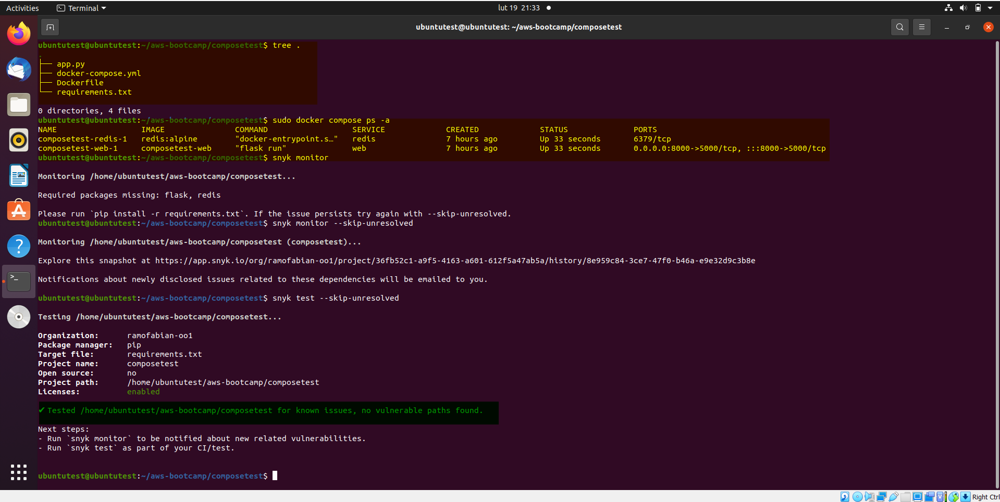</p>

The same result seen from Snyk website:

<p align="center">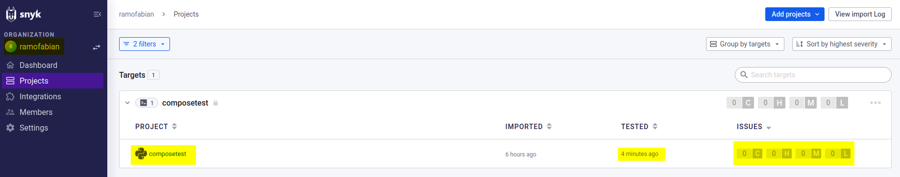</p>

### Containerize Application (Dockerfiles, Docker Compose)
:white_check_mark: DONE. I didn't have any issues with running and bulding the dockerfiles and docker-compose.yml file becuasu I have some expirieance already with docker. Please find below my evidences of the work done:

#### Backend dockerfile
The file called "Dockerfile" inside of folder "backend-flask" was executed and the image was build with rm option which force the automatic container removal as soonas it is stopped:

<p align="center">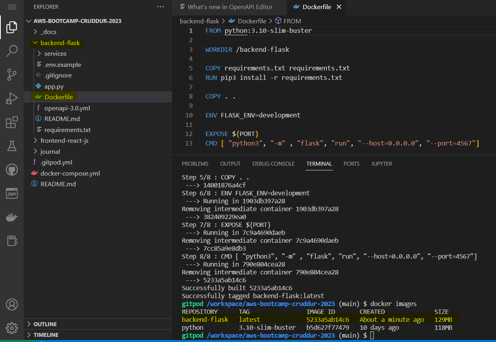</p>

Required local enviroments are were loaded and the previous created image called "backend-flask" is used to build the container attached, so the container output is prompted by the system.

<p align="center">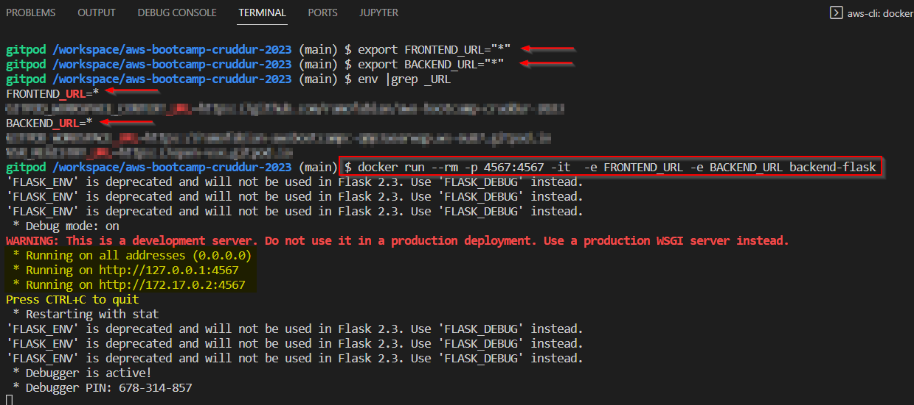</p>

As a requisit, the port must be in public state on gitpod VSCode platform:

<p align="center">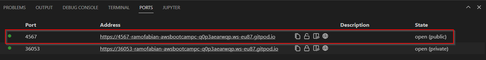</p>

As a result, we can enter the URL and by adding the path `/api/activities/home` at the end, we will be able to see the backend response in a json fromat as shos the picture below:

<p align="center">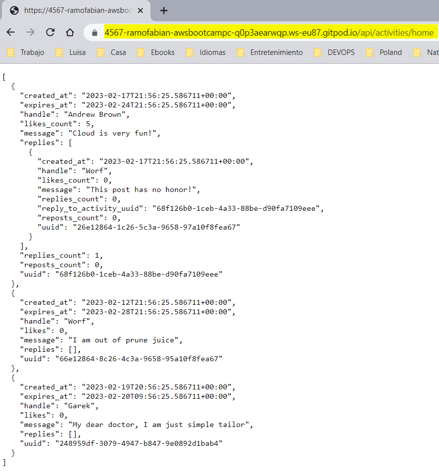</p>

Then we stop the container and run it in deatch mode, so we can check it's status and logs as it is stated below:

<p align="center">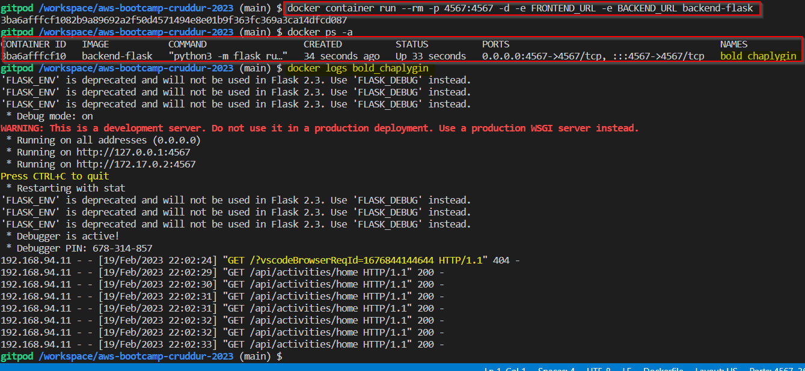</p>

#### Frontend dockerfile
The React framework is installed with command `npm i` and the file called "Dockerfile" inside of folder "frontend-react-js" was executed and the image was build:
<table>
  <tr>
<td><p align="center">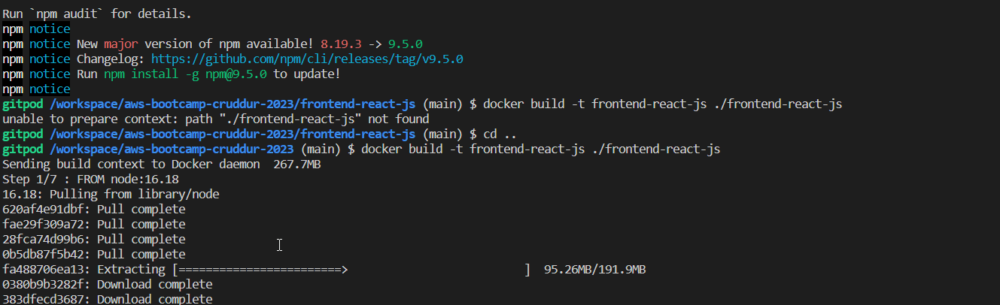</p></td>
<td><p align="center">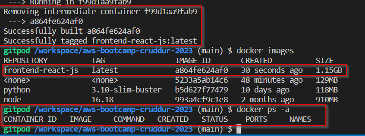</p></td>
  </tr>
</table>

Then the container is deployed in deatach mode and the logs are checked without seeing any problem:

<td><p align="center">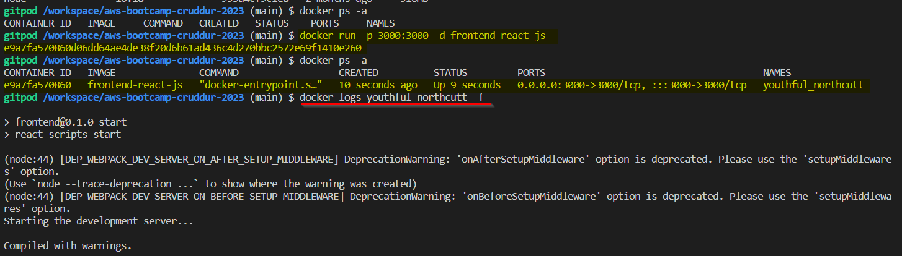</p></td>

We make sure the port is running in publick mode:

<td><p align="center">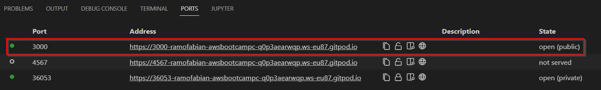</p></td>

And we can see hat we can open the URL in a new explorer tab:

<td><p align="center">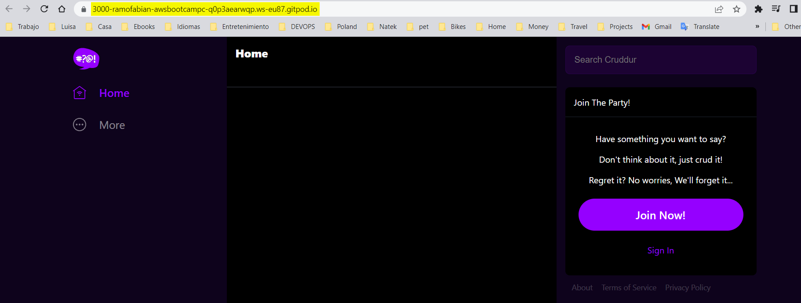</p></td>

Finally we stop an remove the container:

<td><p align="center">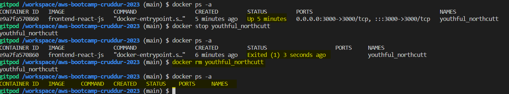</p></td>

#### Docker compose
A new file called docker-compose.yml needs to be created at `/workspace/aws-bootcamp-cruddur-2023` path with the following information:

<p align="center"></p>

```
version: "3.8"
services:
  backend-flask:
    environment:
      FRONTEND_URL: "https://3000-${GITPOD_WORKSPACE_ID}.${GITPOD_WORKSPACE_CLUSTER_HOST}"
      BACKEND_URL: "https://4567-${GITPOD_WORKSPACE_ID}.${GITPOD_WORKSPACE_CLUSTER_HOST}"
    build: ./backend-flask
    ports:
      - "4567:4567"
    volumes:
      - ./backend-flask:/backend-flask
  frontend-react-js:
    environment:
      REACT_APP_BACKEND_URL: "https://4567-${GITPOD_WORKSPACE_ID}.${GITPOD_WORKSPACE_CLUSTER_HOST}"
    build: ./frontend-react-js
    ports:
      - "3000:3000"
    volumes:
      - ./frontend-react-js:/frontend-react-js

# the name flag is a hack to change the default prepend folder
# name when outputting the image names
networks: 
  internal-network:
    driver: bridge
    name: cruddur
```

With the command `docker-compose up -d ` the backend and frontend images are build based on previous dockerfiles, then they are used to deploy the containers connected with an internal network called cruddur.

<p align="center">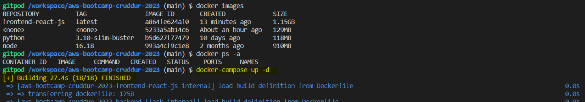</p>

The containers status and images can be seen working fine as it is displayed on the picture below:

<p align="center">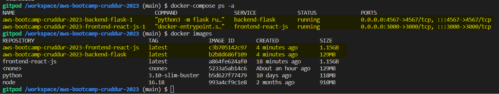</p>
