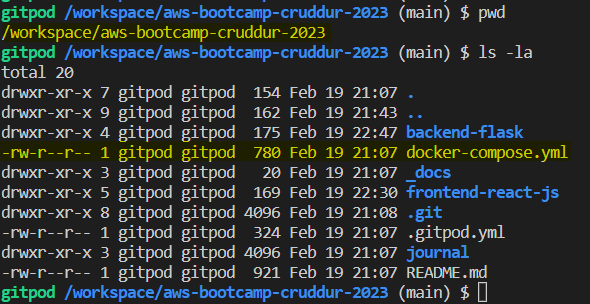

# Week 1 — App Containerization
## Required Homework/Tasks
### Watched Grading Homework Summaries
:white_check_mark: DONE.
### Watched Week 1 - Live Streamed Video
:white_check_mark: DONE.
### Remember to Commit Your Code
:white_check_mark: DONE.
### Watcked Chirag's Week 1 - Spending Considerations
:white_check_mark: DONE.
### Watched Ashish's Week 1 - Container Security Considerations
:white_check_mark: DONE.

I installed snyk and docker compose on my prsonal ubuntu VM and ran the docker-compose.yml as it was done from the video. Then I scanned the running docker containers to see if there is any security breaches. It was good exersice and very much stright forward procedure, I liked it becuse this is something that I had never done before.

I followed this procedure form this [link](https://docs.snyk.io/snyk-cli/install-the-snyk-cli)
```bash
# To download the packet
curl https://static.snyk.io/cli/latest/snyk-linux
chmod +x ./snyk
mv ./snyk /usr/local/bin/

# Check the version
snyk --version

# Login on Snyk system 
snyk auth

# Go to your to your docker directory where docker composer is placed
cd <<your docker directory>>

# Monitor de version immages
snyk monitor

# Scan your running container
snyk test 
```

Find below the evidence of the scan perfomed snyk CLI:

<p align="center"></p>

The same result seen from Snyk website:

<p align="center"></p>

### Containerize Application (Dockerfiles, Docker Compose)
:white_check_mark: DONE. I didn't have any issues with running and bulding the dockerfiles and docker-compose.yml file because I have some expirieance already with docker. Please find below my evidences of the work done:

#### Backend dockerfile
The file called "Dockerfile" inside of folder "backend-flask" was executed and the image was build with rm option which force the automatic container removal as soonas it is stopped:

<p align="center"></p>

Required local enviroments are were loaded and the previous created image called "backend-flask" is used to build the container attached, so the container output is prompted by the system.

<p align="center"></p>

As a requisit, the port must be in public state on gitpod VSCode platform:

<p align="center"></p>

As a result, we can enter the URL and by adding the path `/api/activities/home` at the end, we will be able to see the backend response in a json fromat as shos the picture below:

<p align="center"></p>

Then we stop the container and run it in deatch mode, so we can check it's status and logs as it is stated below:

<p align="center"></p>

#### Frontend dockerfile
The React framework is installed with command `npm i` and the file called "Dockerfile" inside of folder "frontend-react-js" was executed and the image was build:
<table>
  <tr>
<td><p align="center"></p></td>
<td><p align="center"></p></td>
  </tr>
</table>

Then the container is deployed in deatach mode and the logs are checked without seeing any problem:

<td><p align="center"></p></td>

We make sure the port is running in publick mode:

<td><p align="center"></p></td>

And we can see hat we can open the URL in a new explorer tab:

<td><p align="center"></p></td>

Finally we stop an remove the container:

<td><p align="center"></p></td>

#### Docker compose
A new file called docker-compose.yml needs to be created at `/workspace/aws-bootcamp-cruddur-2023` directory with the following information:

<p align="center"></p>

Then add the information information below inside of your docker-file:
```yml
version: "3.8"
services:
  backend-flask:
    environment:
      FRONTEND_URL: "https://3000-${GITPOD_WORKSPACE_ID}.${GITPOD_WORKSPACE_CLUSTER_HOST}"
      BACKEND_URL: "https://4567-${GITPOD_WORKSPACE_ID}.${GITPOD_WORKSPACE_CLUSTER_HOST}"
    build: ./backend-flask
    ports:
      - "4567:4567"
    volumes:
      - ./backend-flask:/backend-flask
  frontend-react-js:
    environment:
      REACT_APP_BACKEND_URL: "https://4567-${GITPOD_WORKSPACE_ID}.${GITPOD_WORKSPACE_CLUSTER_HOST}"
    build: ./frontend-react-js
    ports:
      - "3000:3000"
    volumes:
      - ./frontend-react-js:/frontend-react-js

# the name flag is a hack to change the default prepend folder
# name when outputting the image names
networks: 
  internal-network:
    driver: bridge
    name: cruddur
```

With the command `docker-compose up -d ` the backend and frontend images are build based on previous dockerfiles, then they are used to deploy the containers connected with an internal network called cruddur.

<p align="center"></p>

The containers status and images can be seen working fine as it is displayed on the picture below:

<p align="center"></p>

### Document the Notification Endpoint for the OpenAI Document
:white_check_mark: DONE. I didn't have any issue when I followed Adrew's video instructions, the procedure is pretty much stright forward. Although I'm not so familiar with APIs programming, I have use them but never programmed one. 

So I did some small research about API, endpoints and Openapi below:
<table><tr><td>
  
<b>API:</b> It is an Application Programming Interface which allows two systems to communicate with one another. It porvides the lenguague and contract for how two systimes interact, providing documentation and specifications about how the information can be transfered; it uses by using <b>HTTP</b> protocol for transfering data with the methods `GET`, `POST`, `PUT`, `UPDATE`, `DELETE`.

<b>Endpoint:</b> It is one comunnication channel and each endpoint is a location from which APIs can access the resouces they need to carry out their function.

<b>OPENAPI:</b> It's an standard used to describe REST API endpoints, this description can be used for humans and machines to discover the capabilities of some API without reading the documentations.

  <b>References:</b> [API information](https://smartbear.com/learn/performance-monitoring/api-endpoints/#:~:text=Simply%20put%2C%20an%20endpoint%20is,of%20a%20server%20or%20service.) and [OPENAPI](https://oai.github.io/Documentation/introduction.html)

</td></tr></table>

With the help of VSC's OpenAPI extension we can easily go through the file `openapi-3.0.yml` located in the directory path `/workspace/aws-bootcamp-cruddur-2023/backend-flask`. This file contains almost all documentation for backend API in format yaml and using OpenAPI sintaxis.  

To create the documentation of the notifications endpoints, we need to have clear that this endpoint will be using the `GET` method to transfer data because the frontend will be consuming only this information to be written in the webpage. Also we use the `tags` properties to group it under `activities` with other endpoint already existing, then we declare the response from the type `array` and the schema `#/components/schemas/Activity` where is already decalred in an object the answer.

```yml
  /api/activities/notifications:
    get:
      description: 'Return a feed of activity for all of those I follow'
      tags:
        - activities
      parameters: []
      responses:
        '200':
          description: "Returns an array of acitivities"
          content:
            application/json:
              schema:
                type: array
                items:
                  $ref: '#/components/schemas/Activity'

#-----Omitted output for brevity--------------                  
components:
  schemas:
    Activity:
      type: object
      properties:
        uuid:
          type: string
          example: 0056a369-4618-43a4-ad88-e7c371bf5582
        display_name:
          type: string
          example: "Andrew Brown"
        handle:
          type: string
          example: "andrewbrown"
        message:
          type: string
          example: "Who likes pineapple on their pizza?"
        replies_count:
          type: integer
          example: 5
        reposts_count:
          type: integer
          example: 2
        likes_count:
          type: integer
          example: 103
        created_at:
          type: string
          example: "2023-02-06T18:11:03+00:00"
        expires_at:
          type: string
          example: "2023-02-06T18:11:03+00:00"
```
Here below is showed how the from documentation this new endpoint was documented and grouped:
<table><tr>
  <td>
<p align="center"></p>
  </td>
  <td>
<p align="center"></p>
  </td>
</tr></table>

<b>Links to files:</b>:point_down:

* [openapi-3.0.yml](https://github.com/ramofabian/aws-bootcamp-cruddur-2023/blob/main/backend-flask/openapi-3.0.yml)


### Write a Flask Backend Endpoint for Notifications
:white_check_mark: DONE. I didn't have any problem with Andrews video, I completed completed this point with his instructions in the video. 

As the backend API is running with `python` and its library `Flask`, we need first to create the route for notifications webpage. This is done in the file `app.py` which is located in `/workspace/aws-bootcamp-cruddur-2023/backend-flask`.

In the file previously mentioned, we have to add this piece of code which basically redirects the `GET` queries with the path `/api/activities/notifications` in the URL to the service `NotificattionsActivities.run()`. Alse we import the library service `services.notificattions_activities` which allow the use of the service:

```py
from services.notificattions_activities import *

#-----Omitted output for brevity--------------   

@app.route("/api/activities/notifications", methods=['GET'])
def data_notifications():
  data = NotificattionsActivities.run()
  return data, 200
  
```
Then inside of in the directory `/workspace/aws-bootcamp-cruddur-2023/backend-flask/services/` we need to create a file called `notificattions_activities.py` where the service will code will be placed. This code has a function called `run()` which retunrs the list which contains information in list and dictionary format:

```py
from datetime import datetime, timedelta, timezone
class NotificattionsActivities:
  def run():
    now = datetime.now(timezone.utc).astimezone()
    results = [{
      'uuid': '68f126b0-1ceb-4a33-88be-d90fa7109eee',
      'handle':  'Benji',
      'message': 'I\'m a dog',
      'created_at': (now - timedelta(days=2)).isoformat(),
      'expires_at': (now + timedelta(days=5)).isoformat(),
      'likes_count': 5,
      'replies_count': 1,
      'reposts_count': 0,
      'replies': [{
        'uuid': '26e12864-1c26-5c3a-9658-97a10f8fea67',
        'reply_to_activity_uuid': '68f126b0-1ceb-4a33-88be-d90fa7109eee',
        'handle':  'Worf',
        'message': 'This post has no honor!',
        'likes_count': 0,
        'replies_count': 0,
        'reposts_count': 0,
        'created_at': (now - timedelta(days=2)).isoformat()
      }],
    },
    {
      'uuid': '66e12864-8c26-4c3a-9658-95a10f8fea67',
      'handle':  'Worf',
      'message': 'I am out of prune juice',
      'created_at': (now - timedelta(days=7)).isoformat(),
      'expires_at': (now + timedelta(days=9)).isoformat(),
      'likes': 0,
      'replies': []
    },
    {
      'uuid': '248959df-3079-4947-b847-9e0892d1bab4',
      'handle':  'Garek',
      'message': 'My dear doctor, I am just simple tailor',
      'created_at': (now - timedelta(hours=1)).isoformat(),
      'expires_at': (now + timedelta(hours=12)).isoformat(),
      'likes': 0,
      'replies': []
    }
    ]
    return results
   ```
   
Once the code is placed the backend its implemented and it can be tested from browser by adding this at the end `/api/activities/notifications`:

<p align="center"></p>

<b>Links to files:</b>:point_down:

* [app.py](https://github.com/ramofabian/aws-bootcamp-cruddur-2023/blob/main/backend-flask/app.py)
* [notificattions_activities.py](https://github.com/ramofabian/aws-bootcamp-cruddur-2023/blob/main/backend-flask/services/notificattions_activities.py)


### Write a React Page for Notifications
:white_check_mark: DONE. This point was more challenging than the others because this is my first time working with react. Although I could follow Andrew's instraction without any issue.

From entry point file called `App.js` located in the directory `/workspace/aws-bootcamp-cruddur-2023/frontend-react-js/src`, where we will be routing the notifications service to `./pages/NotificationsActivities`:

```js
import NotificationsActivities from './pages/NotificationsActivities';
#-----Omitted output for brevity--------------   
 {
    path: "/notifications",
    element: <NotificationsActivities />
  },
```
Now we need to created the files `NotificationsActivities.js` (notifications web page) and `NotificationsActivities.css` (css styling file) in the path `/workspace/aws-bootcamp-cruddur-2023/frontend-react-js/src/pages/`. Inside this file we need to add this code which builds the webpage for notifications:

```js
import './NotificationsActivities.css';
import React from "react";

import DesktopNavigation  from '../components/DesktopNavigation';
import DesktopSidebar     from '../components/DesktopSidebar';
import ActivityFeed from '../components/ActivityFeed';
import ActivityForm from '../components/ActivityForm';
import ReplyForm from '../components/ReplyForm';

// [TODO] Authenication
import Cookies from 'js-cookie'

export default function NotificationsFeedPage() {
  const [activities, setActivities] = React.useState([]);
  const [popped, setPopped] = React.useState(false);
  const [poppedReply, setPoppedReply] = React.useState(false);
  const [replyActivity, setReplyActivity] = React.useState({});
  const [user, setUser] = React.useState(null);
  const dataFetchedRef = React.useRef(false);

  const loadData = async () => {
    try {
      const backend_url = `${process.env.REACT_APP_BACKEND_URL}/api/activities/notifications`
      const res = await fetch(backend_url, {
        method: "GET"
      });
      let resJson = await res.json();
      if (res.status === 200) {
        setActivities(resJson)
      } else {
        console.log(res)
      }
    } catch (err) {
      console.log(err);
    }
  };

  const checkAuth = async () => {
    console.log('checkAuth')
    // [TODO] Authenication
    if (Cookies.get('user.logged_in')) {
      setUser({
        display_name: Cookies.get('user.name'),
        handle: Cookies.get('user.username')
      })
    }
  };

  React.useEffect(()=>{
    //prevents double call
    if (dataFetchedRef.current) return;
    dataFetchedRef.current = true;

    loadData();
    checkAuth();
  }, [])

  return (
    <article>
      <DesktopNavigation user={user} active={'notifications'} setPopped={setPopped} />
      <div className='content'>
        <ActivityForm  
          popped={popped}
          setPopped={setPopped} 
          setActivities={setActivities} 
        />
        <ReplyForm 
          activity={replyActivity} 
          popped={poppedReply} 
          setPopped={setPoppedReply} 
          setActivities={setActivities} 
          activities={activities} 
        />
        <ActivityFeed 
          title="Notifications" 
          setReplyActivity={setReplyActivity} 
          setPopped={setPoppedReply} 
          activities={activities} 
        />
      </div>
      <DesktopSidebar user={user} />
    </article>
  );
}
```

Then the the frontend is ready to be used and consume info from backend:

<p align="center"></p>

<b>Links to files:</b>:point_down:

* [App.js](https://github.com/ramofabian/aws-bootcamp-cruddur-2023/blob/main/frontend-react-js/src/App.js)
* [NotificationsActivities.js](https://github.com/ramofabian/aws-bootcamp-cruddur-2023/blob/main/frontend-react-js/src/pages/NotificationsActivities.js)

### Run DynamoDB Local Container and ensure it works
:white_check_mark: DONE. I didn't have any issue to follow Andrew's procedure, hoever it was my first time with DynamoDB.

To run DynamonDB and Postgres services, we need to update the `docker-compose.yml` file to simplify the container execution. Because both databases must run in separated containers and have access to backend and frontend network managed by docker deamon. 

The following code should be added in the docker compose file. There the dynamoDB container will be created with the port 8000 open, volume is mounted in the directory path `./docker/dynamodb` at host level and `/home/dynamodblocal/data` at container, each time we login into the container the defail dir will be `/home/dynamodblocal`, and the DB will has the local user: `root`.

```yml
services: #this line can be ommitted  because is already declared in the docker-compose.yml file
  dynamodb-local:
    # https://stackoverflow.com/questions/67533058/persist-local-dynamodb-data-in-volumes-lack-permission-unable-to-open-databa
    # We needed to add user:root to get this working.
    user: root
    command: "-jar DynamoDBLocal.jar -sharedDb -dbPath ./data"
    image: "amazon/dynamodb-local:latest"
    container_name: dynamodb-local
    ports:
      - "8000:8000"
    volumes:
      - "./docker/dynamodb:/home/dynamodblocal/data"
    working_dir: /home/dynamodblocal
 ```

This piece of code should be pased as it is seen in the this link: :point_right: [docker-compose.yml](https://github.com/ramofabian/aws-bootcamp-cruddur-2023/blob/main/docker-compose.yml?plain=1#L20-L31). 

Then the docker-compose file can be executed make sure the ports are in `open (public)` state.

<p align="center"></p>

The port 8000 must be in open (public) state:

<p align="center"></p>

To probe the DB reachability, AWS CLI will be needed to create a table, create an item and then list the table with the information. Those commands are taken from this repo :point_right: [100DaysOfCloud](https://github.com/100DaysOfCloud/challenge-dynamodb-local)

<b>Creating a table</b>

In the command below the table called `Music` is created to be used through URL: `http://localhost:8000` and it has 2 attributes `Artist` and `SongTitle`.

```bash
aws dynamodb create-table \
    --endpoint-url http://localhost:8000 \
    --table-name Music \
    --attribute-definitions \
        AttributeName=Artist,AttributeType=S \
        AttributeName=SongTitle,AttributeType=S \
    --key-schema AttributeName=Artist,KeyType=HASH AttributeName=SongTitle,KeyType=RANGE \
    --provisioned-throughput ReadCapacityUnits=1,WriteCapacityUnits=1 \
    --table-class STANDARD
```

Output:
```
{
    "TableDescription": {
        "AttributeDefinitions": [
            {
                "AttributeName": "Artist",
                "AttributeType": "S"
            },
            {
                "AttributeName": "SongTitle",
                "AttributeType": "S"
            }
        ],
        "TableName": "Music",
        "KeySchema": [
            {
                "AttributeName": "Artist",
                "KeyType": "HASH"
            },
            {
                "AttributeName": "SongTitle",
                "KeyType": "RANGE"
            }
        ],
        "TableStatus": "ACTIVE",
        "CreationDateTime": "2023-02-21T23:04:14.290000+00:00",
        "ProvisionedThroughput": {
            "LastIncreaseDateTime": "1970-01-01T00:00:00+00:00",
            "LastDecreaseDateTime": "1970-01-01T00:00:00+00:00",
            "NumberOfDecreasesToday": 0,
            "ReadCapacityUnits": 1,
            "WriteCapacityUnits": 1
        },
        "TableSizeBytes": 0,
        "ItemCount": 0,
        "TableArn": "arn:aws:dynamodb:ddblocal:000000000000:table/Music"
    }
}
gitpod /workspace/aws-bootcamp-cruddur-2023 (main) $ 
```

<b>Creating an item</b>

In this command the information is added to `Music` table and attribute `AlbumTitle` is added with the respective information.

```bash
aws dynamodb put-item \
    --endpoint-url http://localhost:8000 \
    --table-name Music \
    --item \
        '{"Artist": {"S": "No One You Know"}, "SongTitle": {"S": "Call Me Today"}, "AlbumTitle": {"S": "Somewhat Famous"}}' \
    --return-consumed-capacity TOTAL  
```

Output:

```
{
    "ConsumedCapacity": {
        "TableName": "Music",
        "CapacityUnits": 1.0
    }
}
```

<b>Listing all tables</b>

```bash
aws dynamodb list-tables --endpoint-url http://localhost:8000
```

Output:

```bash
gitpod /workspace/aws-bootcamp-cruddur-2023 (main) $ aws dynamodb list-tables --endpoint-url http://localhost:8000
{
    "TableNames": [
        "Music"
    ]
}
```

<b>Getting all records from table Music</b>

```bash
aws dynamodb scan --table-name Music --query "Items" --endpoint-url http://localhost:8000
```

Output:

```bash
gitpod /workspace/aws-bootcamp-cruddur-2023 (main) $ aws dynamodb scan --table-name Music --query "Items" --endpoint-url http://localhost:8000
[
    {
        "Artist": {
            "S": "No One You Know"
        },
        "SongTitle": {
            "S": "Call Me Today"
        },
        "AlbumTitle": {
            "S": "Somewhat Famous"
        }
    }
]
gitpod /workspace/aws-bootcamp-cruddur-2023 (main) $ 
```

### Run Postgres Container and ensure it works
:white_check_mark: DONE. I didn't have any issue to follow Andrew's procedure. I have some expiriance with MariaDB, however it was my first time with Postgres.

Below you can find the configuration to deploy postgres DB container which uses version `13-alpine`, user and password set withing `enviroment` paramater, the port 5432 and the local volume mounted in the path `/var/lib/postgresql/data` insisde of container.

<b>Note:</b> the `restart: always` is a policy that "Always restart the container if it stops. If it is manually stopped, it is restarted only when Docker daemon restarts or the container itself is manually restarted". Source: [Docker docs](https://docs.docker.com/config/containers/start-containers-automatically/)

```yml
services: #This line can be ommitted because is already declared in the docker-compose.yml file
  db:
    image: postgres:13-alpine
    restart: always
    environment:
      - POSTGRES_USER=postgres
      - POSTGRES_PASSWORD=password
    ports:
      - '5432:5432'
    volumes: 
      - db:/var/lib/postgresql/data
volumes:
  db:
    driver: local
```

This piece of code should be pasted as it is seen in the this link: :point_right: [docker-compose.yml](https://github.com/ramofabian/aws-bootcamp-cruddur-2023/blob/main/docker-compose.yml?plain=1#L32-L52).

The file `docker-compose.yml` can be executed to deploy the container, after seeing them up make sure the ports are in `open (public)` state.

<p align="center"></p>
<p align="center"></p>

With the command `docker volume inspect aws-bootcamp-cruddur-2023_db` can be seen local volume attached to container `aws-bootcamp-cruddur-2023_db` and the local path to find the volume location.

```json
gitpod /workspace/aws-bootcamp-cruddur-2023 (main) $ docker volume inspect aws-bootcamp-cruddur-2023_db
[
    {
        "CreatedAt": "2023-02-22T20:41:35Z",
        "Driver": "local",
        "Labels": {
            "com.docker.compose.project": "aws-bootcamp-cruddur-2023",
            "com.docker.compose.version": "2.10.0",
            "com.docker.compose.volume": "db"
        },
        "Mountpoint": "/workspace/.docker-root/volumes/aws-bootcamp-cruddur-2023_db/_data",
        "Name": "aws-bootcamp-cruddur-2023_db",
        "Options": null,
        "Scope": "local"
    }
]
gitpod /workspace/aws-bootcamp-cruddur-2023 (main) $ 
```

To check the right functionality of postgres DB container, its required the installation of postgres client on Gitpod, the commands below which can be run from gitpod shell or can be included in `.gitpod.yml` like :point_right: [here](https://github.com/ramofabian/aws-bootcamp-cruddur-2023/blob/main/.gitpod.yml?plain=1#L11-L16): 

```yml
  - name: postgres
    init: |
      curl -fsSL https://www.postgresql.org/media/keys/ACCC4CF8.asc|sudo gpg --dearmor -o /etc/apt/trusted.gpg.d/postgresql.gpg
      echo "deb http://apt.postgresql.org/pub/repos/apt/ `lsb_release -cs`-pgdg main" |sudo tee  /etc/apt/sources.list.d/pgdg.list
      sudo apt update
      sudo apt install -y postgresql-client-13 libpq-dev
```

The command `psql -h localhost -U postgres` can be used to connect via CLI: 

<p align="center"></p>


:point_up: Optional, the installation of postgres DB plugin can be automated by adding the following code in `.gitpod.yml`:

```yml
vscode:
  extensions:
    - cweijan.vscode-postgresql-client2
```

<p align="center"></p>

### Run the dockerfile CMD as an external script
### Push and tag a image to DockerHub (they have a free tier)
### Use multi-stage building for a Dockerfile build
### Implement a healthcheck in the V3 Docker compose file
### Research best practices of Dockerfiles and attempt to implement it in your Dockerfile
### Learn how to install Docker on your localmachine and get the same containers running outside of Gitpod / Codespaces
### Launch an EC2 instance that has docker installed, and pull a container to demonstrate you can run your own docker processes. 
