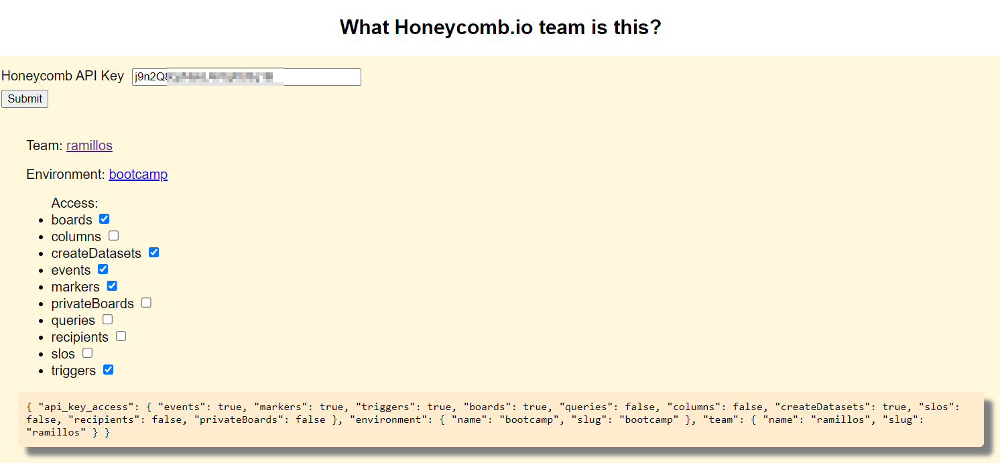

# Week 2 — Distributed Tracing
## Required Homework/Tasks
### Watch Week 2 Live-Stream Video	
:white_check_mark: DONE.
### Watch Chirag Week 2 - Spending Considerations 
### Watched Ashish's Week 2 - Observability Security Considerations	
### Instrument Honeycomb with OTEL
:white_check_mark: DONE. It was hard for me because it's the first time I use tracing, I had issues during the implmentation but I could fix them up in the way.

1. From Honeycomb

- Creating new enviroment in Honey enviroment  called "bootcamp"

<p align="center"></p>

- Getting enviroment API key:

<p align="center"></p>

- These are the priviledges for `bootcamp` enviroment, it can be seen from this [link](https://honeycomb-whoami.glitch.me/trace) and adding the API key.

<p align="center"></p>

2. Save Honeycomb variables on gitpod and docker-compose file

- CLI variables:

<p align="center"></p>

- Saved Gitpod variables:

<p align="center"></p>

- Adding the `OTEL` variables in `docker-compose.yml` for backend service:

```yml
version: "3.8"
services:
  backend-flask:
    environment:
      FRONTEND_URL: "https://3000-${GITPOD_WORKSPACE_ID}.${GITPOD_WORKSPACE_CLUSTER_HOST}"
      BACKEND_URL: "https://4567-${GITPOD_WORKSPACE_ID}.${GITPOD_WORKSPACE_CLUSTER_HOST}"
      OTEL_SERVICE_NAME: "backend-flask"
      OTEL_EXPORTER_OTLP_ENDPOINT: "https://api.honeycomb.io"
      OTEL_EXPORTER_OTLP_HEADERS: "x-honeycomb-team=${HONEYCOMB_API_KEY}"
    build: ./backend-flask
    ports:
      - "4567:4567"
    volumes:
      - ./backend-flask:/backend-flask
```

3. Adding addtional Hoenycomb python packets.

The following commands should be added under backend `requirements.txt` file, like is present in this :point_right: [Link](https://github.com/ramofabian/aws-bootcamp-cruddur-2023/blob/main/backend-flask/requirements.txt?plain=1#L4-L8):

```bash
pip install opentelemetry-api
pip install opentelemetry-sdk
pip install opentelemetry-exporter-otlp-proto-http
pip install opentelemetry-instrumentation-flask
pip install opentelemetry-instrumentation-requests

```

The file `requirements.txt` is used by backend dockerfile to build the image and be able to use `Hoenycomb` api.

4. Initialize the tracer and flask instrumentation to send data to Honeycomb and enable console logging within flask app. To do it, we need to add code below in `app.py` file within backend folder:

```python
# Honeycomb libs -----------------
from opentelemetry import trace
from opentelemetry.instrumentation.flask import FlaskInstrumentor
from opentelemetry.instrumentation.requests import RequestsInstrumentor
from opentelemetry.exporter.otlp.proto.http.trace_exporter import OTLPSpanExporter
from opentelemetry.sdk.trace import TracerProvider
from opentelemetry.sdk.trace.export import BatchSpanProcessor
from opentelemetry.sdk.trace.export import SimpleSpanProcessor
from opentelemetry.sdk.trace.export import ConsoleSpanExporter

# Honeycomb libs -----------------
# Initialize tracing and an exporter that can send data to Honeycomb
provider = TracerProvider()
processor = BatchSpanProcessor(OTLPSpanExporter())
provider.add_span_processor(processor)

# Show this in the logs within the backend-flask app (STDOUT)
#this is used for troubleshooting and shouldn't run in production env
simple_processor = SimpleSpanProcessor(ConsoleSpanExporter())
provider.add_span_processor(simple_processor)

trace.set_tracer_provider(provider)
tracer = trace.get_tracer(__name__)

app = Flask(__name__) 

# Honeycomb libs -----------------
# Initialize automatic instrumentation with Flask
FlaskInstrumentor().instrument_app(app)
RequestsInstrumentor().instrument()
```

Note: This code can seen in this :point_right: [Link](https://github.com/ramofabian/aws-bootcamp-cruddur-2023/blob/main/backend-flask/app.py?plain=1#L17-L45)

5. Run the `docker-compose.yml` file and if the information is being collected in honeycomb, the prompt should show the logs after any action from browser and from Honeycomb webseid we should see the data plotted.

- Logging from CLI, the traing messages are seen in json format:

<p align="center"></p>

- Logging from Honeycomb website, the information is plotted in the charts:

<p align="center"></p>

6. To create the spam for some specific service, the following code should be added inside of service `.py` file:

- In this case the code was added at `/backend-flask/services/home_activities.py`, it can be seen in this :point_right: [link](https://github.com/ramofabian/aws-bootcamp-cruddur-2023/blob/main/backend-flask/services/home_activities.py)

```python
from opentelemetry import trace

tracer = trace.get_tracer(__name__)

class HomeActivities:
  def run():
    with tracer.start_as_current_span("home-activities-mock-data"): #here the span is named
      span = trace.get_current_span()
      now = datetime.now(timezone.utc).astimezone()
      span.set_attribute("app.now", now.isoformat()) # here the info is added and named as "app.now" and the value is the date.
      span.set_attribute("app.result_length", len(results)) # Second attribute 
```

- After this change, the span information can be seen from the website:

<p align="center"></p>

7. From Honeycomb website queries can be run to analize the collected data, all of the can be perfomred form 'New query button':

<p align="center"></p>

<b>References:</b> [Honeycomb documentation](https://docs.honeycomb.io/getting-data-in/opentelemetry/python/#sampling) and [Open Telemtry](https://opentelemetry.io/docs/)

### Instrument AWS X-Ray	
:white_check_mark: DONE. It was very hard to understand and make it works, the documentation is very extensive and tricky!!. Although, with Andrew's videos it was far way easy.

<table>
  
  <b>Definitions:</b>
  * <b>AWS X-Ray:</b> It's an Amazon service which gathers data based on requests made to its application (API), it also has tools to query, filter and get information regarding collected information. The gathered information is usefull to identify problems and identify optimization oportunites.
  
  * Services send data to X-Ray as <b>segments</b>, it groups them according to common information in `traces`.
  
  * The `segments` can contains constrained information about subtasks as <b>subsegments</b>. It provides more detailled information about the service subprocess.
  
  * The <b>traces</b> tracks the path of some specific request and collects all segments and subsegments by a single request.

</table>

To instrument AWS X-Ray in backend side, the following steps were performed:

1. The python packet `aws-xray-sdk` is added to `requirements.txt` file. :point_right: [Link to file](https://github.com/ramofabian/aws-bootcamp-cruddur-2023/blob/main/backend-flask/requirements.txt?plain=1#L10).

2. Add the following code in `app.py`. :point_right: [Link to file](https://github.com/ramofabian/aws-bootcamp-cruddur-2023/blob/main/backend-flask/app.py?plain=1#L27-L49).

```python
from aws_xray_sdk.core import xray_recorder
from aws_xray_sdk.ext.flask.middleware import XRayMiddleware

xray_url = os.getenv("AWS_XRAY_URL")
xray_recorder.configure(service='Backend-flask', dynamic_naming=xray_url)
XRayMiddleware(app, xray_recorder)
```

- Add this line `@xray_recorder.capture('activities_home')` in `/api/activities/home` endpoint as it's shown below to create the segment 'activities_home'. [Link to file](https://github.com/ramofabian/aws-bootcamp-cruddur-2023/blob/main/backend-flask/app.py?plain=1#L102-L106).

```python
@app.route("/api/activities/home", methods=['GET'])
@xray_recorder.capture('activities_home')
def data_home():
  data = HomeActivities.run()
  return data, 200
```

- Add this line `@xray_recorder.capture('activities_users')` in `/api/activities/home` endpoint as it's shown below to create the segment 'activities_users'. [Link to file](https://github.com/ramofabian/aws-bootcamp-cruddur-2023/blob/main/backend-flask/app.py?plain=1#L113-L120).

```python
@app.route("/api/activities/@<string:handle>", methods=['GET'])
@xray_recorder.capture('activities_users')
def data_handle(handle):
  model = UserActivities.run(handle)
  if model['errors'] is not None:
    return model['errors'], 422
  else:
    return model['data'], 200
```

3. Add the following code in `backend-flask/services/user_activities.py` to create a subsegment called 'moc-data'. [Link to file](https://github.com/ramofabian/aws-bootcamp-cruddur-2023/blob/main/backend-flask/services/user_activities.py).

```python
# X-Ray -----------------
from aws_xray_sdk.core import xray_recorder

# X-Ray -----------------
    # Start a subsegment
    subsegment = xray_recorder.begin_subsegment('mock-data')
    dict = {
      "now": now.isoformat(),
      "results-size": len(model['data'])
    }
    subsegment.put_metadata('key', dict, 'namespace')
    xray_recorder.end_subsegment()
```

4. Setup AWS X-Ray Resources by adding the the file `xray.json` in this directory `aws/json/`. This file should contains the following below. :point_right: [Link to file](https://github.com/ramofabian/aws-bootcamp-cruddur-2023/blob/main/aws/json/xray.json).
```json
{
  "SamplingRule": {
      "RuleName": "Cruddur",
      "ResourceARN": "*",
      "Priority": 9000,
      "FixedRate": 0.1,
      "ReservoirSize": 5,
      "ServiceName": "Cruddur",
      "ServiceType": "*",
      "Host": "*",
      "HTTPMethod": "*",
      "URLPath": "*",
      "Version": 1
  }
}
```

5. Create the group by running the command below:

```bash
aws xray create-group \
   --group-name "Cruddur" \
   --filter-expression "service(\"Backend-flask\")"
```
- Command launched from Gitpod bash CLI:

<p align="center"></p>

- Group created seen from AWS website:

<p align="center"></p>

6. Run the command below to create a rule for the group `Cruddur` created in step 4.
 
```bash
aws xray create-sampling-rule --cli-input-json file://aws/json/xray.json
```

- Command executed from CLI:

<p align="center"></p>

- Rule seen from AWS website:

<p align="center"></p>

7. Add the following lines in `docker-compose.yml` file:

- Adding `aws-xray-deamon` service. :point_right: [Link to file](https://github.com/ramofabian/aws-bootcamp-cruddur-2023/blob/main/docker-compose.yml?plain=1#L47-L56).

```yml
  xray-daemon:
    image: "amazon/aws-xray-daemon"
    environment:
      AWS_ACCESS_KEY_ID: "${AWS_ACCESS_KEY_ID}"
      AWS_SECRET_ACCESS_KEY: "${AWS_SECRET_ACCESS_KEY}"
      AWS_REGION: "eu-central-1"
    command:
      - "xray -o -b xray-daemon:2000"
    ports:
      - 2000:2000/udp
```

- Adding `aws-xray-deamon` enviroment variables in backend service. :point_right: [Link to file](https://github.com/ramofabian/aws-bootcamp-cruddur-2023/blob/main/docker-compose.yml?plain=1#L10-L11).

```yml
AWS_XRAY_URL: "*4567-${GITPOD_WORKSPACE_ID}.${GITPOD_WORKSPACE_CLUSTER_HOST}*"
AWS_XRAY_DAEMON_ADDRESS: "xray-daemon:2000"
```

8. Run `docker-compose.yml` file, open `xray-daemon` console, open the frontend URL on browser and interact between home page and Andrew's profile many times to triger traces from backend to AWS X-Ray. 

- The logs below should be seen from CLI:

<p align="center"></p>

- The information should be seen from AWS X-Ray traces:

<p align="center"></p>

- Making click on one of the traces the `segment` and `subsegment` previusly created and its metadata:

Subsegment overview info:

<p align="center"></p>

Subsegment metadata:

<p align="center"></p>


### Configure custom logger to send to CloudWatch Logs	
### Integrate Rollbar and capture and error
