# Week 3 — Decentralized Authentication
## Mandatory tasks
### Watched Ashish's Week 3 - Decenteralized Authentication	
:white_check_mark: DONE.
### Watch Chirag Week 3 - Spending Considerations	
### Setup Cognito User Pool	
:white_check_mark: DONE. I had some issues with the user pool and I had to recreated it a couple times, becuase I had missed some features to make it work properly.

The following parameters were used create the user pool correctly via web from AWS Cognito for ours Cruddur application:
```
* User pool name: cruddur-user-pool
* provider option: Cognito user pool (default)
* Cognito user pool sign-in: email
* Multi-factor autenticator: No MFA
* User account recovery: Enable self-service account recovery and email only
* Required attributes: name and preferred_username
* Email: Send email with Cognito
* Integrate your app (User pool name): cruddur-user-pool
* Initial app client: Public client
* App client name: cruddur
```

- Please find below the user pool created:

<p align="center"></p>

- Created users:
 
<p align="center">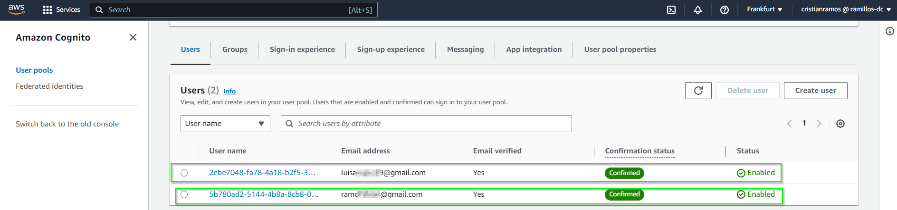</p>

- With the command `aws cognito-idp list-user-pools --max-results 20`

<p align="center">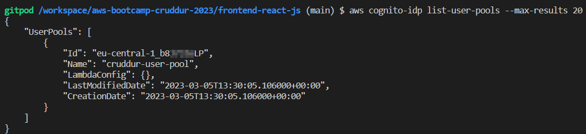</p>

- With the command `aws cognito-idp describe-user-pool --user-pool-id <<user_pool_id>>` the user pool configuration can be seen from AWS CLI

- With the command `aws cognito-idp list-user-pool-clients --user-pool-id <<user_pool_id>>` the app client are listed:

<p align="center">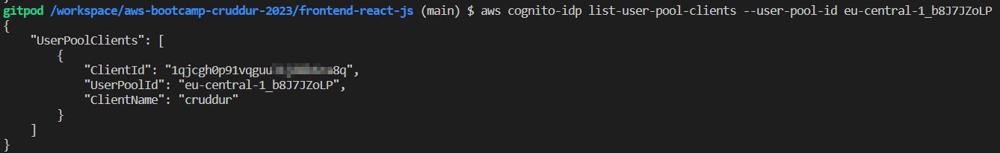</p>

- With this command the created users under `cruddur-user-pool` administration `aws cognito-idp list-users --user-pool-id <<user_pool_id>>`

<p align="center">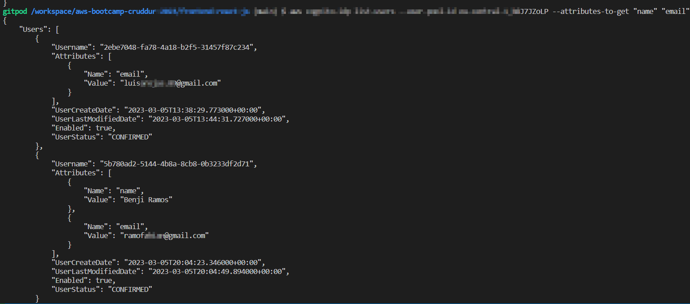</p>

<b>References:</b> [AWS CLI Reference](https://docs.aws.amazon.com/cli/latest/index.html) and [AWS web tutotial](https://docs.aws.amazon.com/cognito/latest/developerguide/tutorial-create-user-pool.html)

### Implement Custom Signin Page
:white_check_mark: DONE.  I didn't have issues to follow Andrew's video, it was really interesting task because I haven used Amplify before.

To connect frontend with AWS Cognito we are using `Amplify` (<b>Definition:</b> It is an open-source solution that lets frontend developers builds, ship and host full stack applications on AWS). The following procedure was performed to implment custom signin page:

1. Run the command `npm i aws-amplify --save` to install the dependecy in `npm` and automatically save it on `aws-bootcamp-cruddur-2023/frontend-react-js/package.json` for future works in the comming weeks.
2. Add the following code in the file `/aws-bootcamp-cruddur-2023/frontend-react-js/src/App.js` to configure `amplify` and hook up our cognito pool to our frontend code:

```js
// Amplify --------------------------
import { Amplify } from 'aws-amplify';

Amplify.configure({
  "AWS_PROJECT_REGION": process.env.REACT_AWS_PROJECT_REGION,
  //"aws_cognito_identity_pool_id": process.env.REACT_APP_AWS_COGNITO_IDENTITY_POOL_ID, //NOT required
  "aws_cognito_region": process.env.REACT_APP_AWS_COGNITO_REGION,
  "aws_user_pools_id": process.env.REACT_APP_AWS_USER_POOLS_ID,
  "aws_user_pools_web_client_id": process.env.REACT_APP_CLIENT_ID,
  "oauth": {},
  Auth: {
    // We are not using an Identity Pool
    // identityPoolId: process.env.REACT_APP_IDENTITY_POOL_ID, // REQUIRED - Amazon Cognito Identity Pool ID
    region: process.env.REACT_AWS_PROJECT_REGION,           // REQUIRED - Amazon Cognito Region
    userPoolId: process.env.REACT_APP_AWS_USER_POOLS_ID,         // OPTIONAL - Amazon Cognito User Pool ID
    userPoolWebClientId: process.env.REACT_APP_CLIENT_ID,   // OPTIONAL - Amazon Cognito Web Client ID (26-char alphanumeric string)
  }
});
```

3. Add the following envariable variables in to frontend service in `docker-compose.yml` file:

```yml
REACT_AWS_PROJECT_REGION: "${AWS_DEFAULT_REGION}"
REACT_APP_AWS_COGNITO_REGION: "${AWS_DEFAULT_REGION}"
REACT_APP_AWS_USER_POOLS_ID: "eu-central-1_b8xxxxoLP"
REACT_APP_CLIENT_ID: "1qjcgh0pxxxxxxxxxxd8k6ra8q"
```

4. Go to `HomeFeedPage.js` file and add the following code to enable autentication on this page and don't forget comment or remove the cookies code:

```js
// congnito ------------------
import { Auth } from 'aws-amplify';

const [user, setUser] = React.useState(null);

// cognito -----------------
// check if we are authenicated
  const checkAuth = async () => {
    Auth.currentAuthenticatedUser({
      // Optional, By default is false. 
      // If set to true, this call will send a 
      // request to Cognito to get the latest user data
      bypassCache: false 
    })
    .then((user) => {
      console.log('user',user);
      return Auth.currentAuthenticatedUser()
    }).then((cognito_user) => {
        setUser({
          display_name: cognito_user.attributes.name,
          handle: cognito_user.attributes.preferred_username
        })
    })
    .catch((err) => console.log(err));
  };
  
  React.useEffect(()=>{
    //prevents double call
    if (dataFetchedRef.current) return;
    dataFetchedRef.current = true;

    loadData();
    checkAuth();
  }, [])
  
// Pass user to the following components
<DesktopNavigation user={user} active={'home'} setPopped={setPopped} />
<DesktopSidebar user={user} />
```

5. Add the folllwoing code in `ProfileInfo.js` and don't forget comment or remove the cookies code: 

```js
import { Auth } from 'aws-amplify';

const signOut = async () => {
  try {
      await Auth.signOut({ global: true });
      window.location.href = "/"
  } catch (error) {
      console.log('error signing out: ', error);
  }
}
```

6. Adding the code below in `SigninPage.js` and don't forget comment or remove the cookies code: 

- We get an access token from AWS API and use it to login

```js
// cognito
import { Auth } from 'aws-amplify';

// Cognito sign
  const onsubmit = async (event) => {
    setErrors('')
    event.preventDefault();
    Auth.signIn(email, password)
      .then(user => {
        console.log('user!', user) 
        localStorage.setItem("access_token", user.signInUserSession.accessToken.jwtToken)
        window.location.href = "/"
      })
      .catch(error => { 
        console.log('Error!', error) //prompt the error in cli
        if (error.code == 'UserNotConfirmedException') {
          window.location.href = "/confirm"
        }
        setErrors(error.message)
      });
    return false
  }
```

7. Login with an unknown email and password, the following error must be seen and from webpage the error: `Incorrect username or password.` must be displayed:

<p align="center">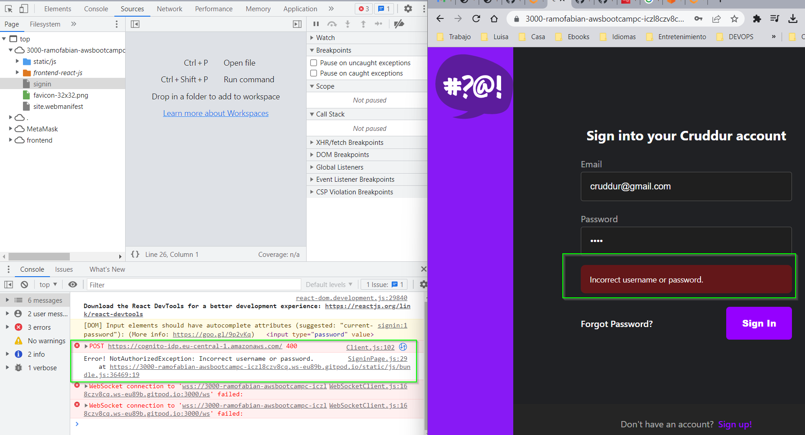</p>

The folllowing command is used to force some account to be in authorized state:

```bash
aws cognito-idp admin-set-user-password --user-pool-id <<user_pool_id>> --username <<user_name>> --password <<pass>> --permanent
```

<p align="center"></p>

Sigin with correct credentials and the user has been validated:

<p align="center">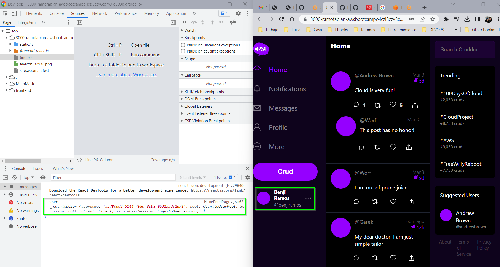</p>

<b>Link to files:</b>
* [package.json](https://github.com/ramofabian/aws-bootcamp-cruddur-2023/blob/main/frontend-react-js/package.json)
* [App.js](https://github.com/ramofabian/aws-bootcamp-cruddur-2023/blob/main/frontend-react-js/src/App.js)
* [docker-compose.yml](https://github.com/ramofabian/aws-bootcamp-cruddur-2023/blob/main/docker-compose.yml)
* [HomeFeedPage.js](https://github.com/ramofabian/aws-bootcamp-cruddur-2023/blob/main/frontend-react-js/src/pages/HomeFeedPage.js)
* [ProfileInfo.js](https://github.com/ramofabian/aws-bootcamp-cruddur-2023/blob/main/frontend-react-js/src/components/ProfileInfo.js)
* [SigninPage.js](https://github.com/ramofabian/aws-bootcamp-cruddur-2023/blob/main/frontend-react-js/src/pages/SigninPage.js)

### Implement Custom Signup Page
:white_check_mark: DONE. I didn't have any issue to follow Andrew's instructions.

To implment the signup page I have followed the next instructions:
1. Go to `SignupPage.js` page located in this directory `aws-bootcamp-cruddur-2023/frontend-react-js/src/pages/` and add the following code:

In this code the form attributes are retrived from web form and sent to Cognito via `aws-amplofy`:

```js
// Cognito
import { Auth } from 'aws-amplify';

// cognito signup
  const onsubmit = async (event) => {
    event.preventDefault();
    setErrors('')
    console.log(name);
    console.log(email);
    console.log(username);
    console.log(password);
    try {
        const { user } = await Auth.signUp({
          username: email,
          password: password,
          attributes: {
              name: name,
              email: email,
              preferred_username: username,
          },
          autoSignIn: { // optional - enables auto sign in after user is confirmed
              enabled: true,
          }
        });
        console.log(user);
        window.location.href = `/confirm?email=${email}`
    } catch (error) {
        console.log(error);
        setErrors(error.message)
    }
    return false
  }

```

New user creation and pending for code confirmation:

<p align="center">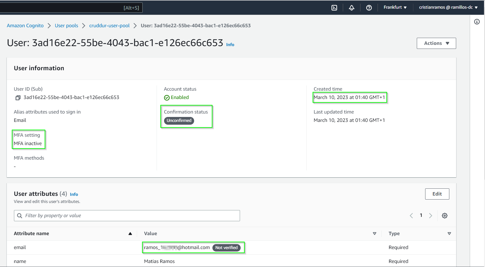</p>

Duplicated images:

<p align="center">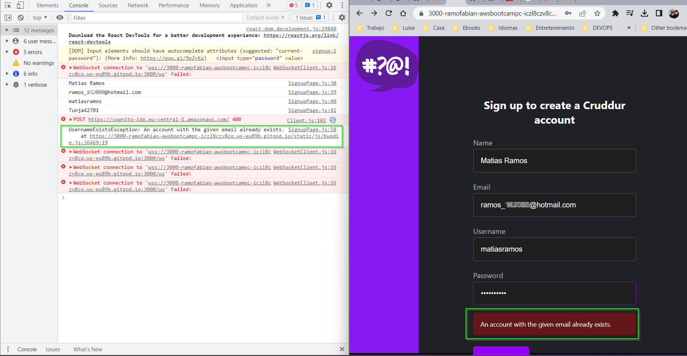</p>

<b>Link to file:</b>
* [SignupPage.js](https://github.com/ramofabian/aws-bootcamp-cruddur-2023/blob/main/frontend-react-js/src/pages/SignupPage.js)

### Implement Custom Confirmation Page
:white_check_mark: DONE. I didn't have any issue to follow Andrew's instructions.

To implment the confirmation page I have followed the next instructions:

1. Add the following code in `ConfirmationPage.js` located in directory `frontend-react-js/src/pages/`

```js
// cognito
import { Auth } from 'aws-amplify';

const resend_code = async (event) => {
    setErrors('')
    try {
      await Auth.resendSignUp(email);
      console.log('code resent successfully');
      setCodeSent(true)
    } catch (err) {
      // does not return a code
      // does cognito always return english
      // for this to be an okay match?
      console.log(err)
      if (err.message == 'Username cannot be empty'){
        setErrors("You need to provide an email in order to send Resend Activiation Code")   
      } else if (err.message == "Username/client id combination not found."){
        setErrors("Email is invalid or cannot be found.")   
      }
    }
    
 const onsubmit = async (event) => {
    event.preventDefault();
    setErrors('')
    try {
      await Auth.confirmSignUp(email, code);
      window.location.href = "/"
      console.log(email + " " + code)
    } catch (error) {
      console.log(error)
      setErrors(error.message)
    }
    return false
  }
```

2. Code sent:

<p align="center">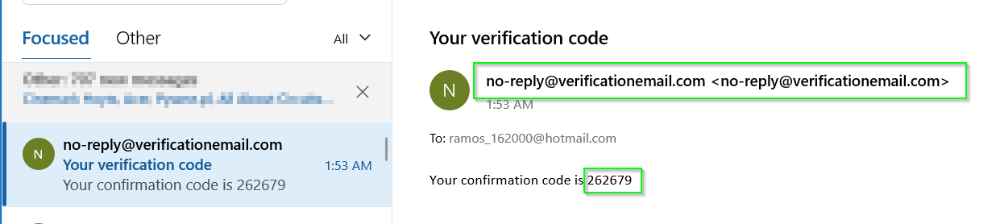</p>

3. Code confirmation:

<p align="center">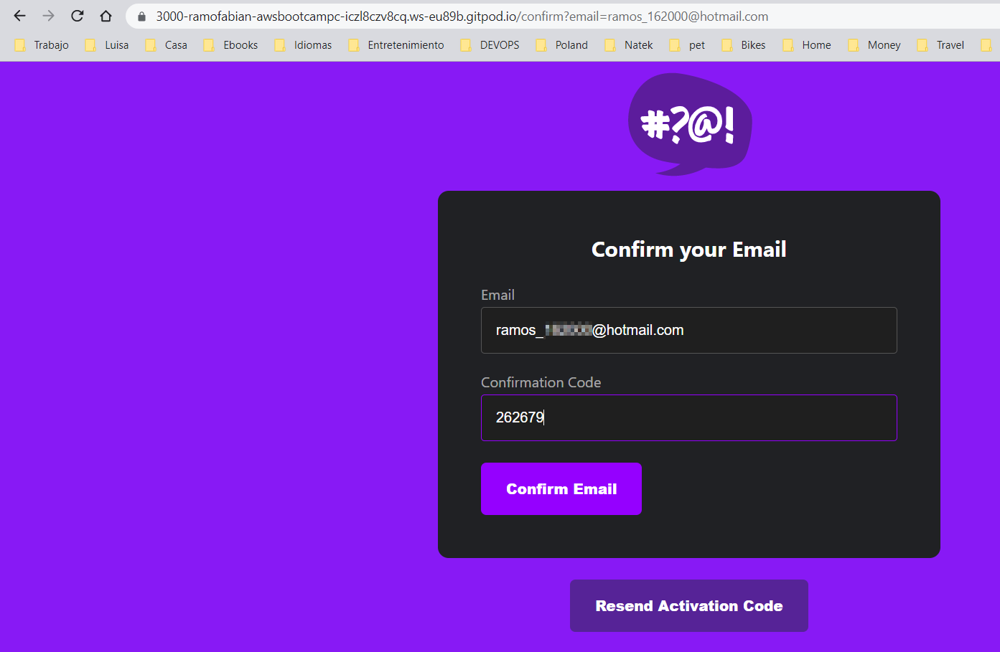</p>

4. Account confirmed:

<p align="center">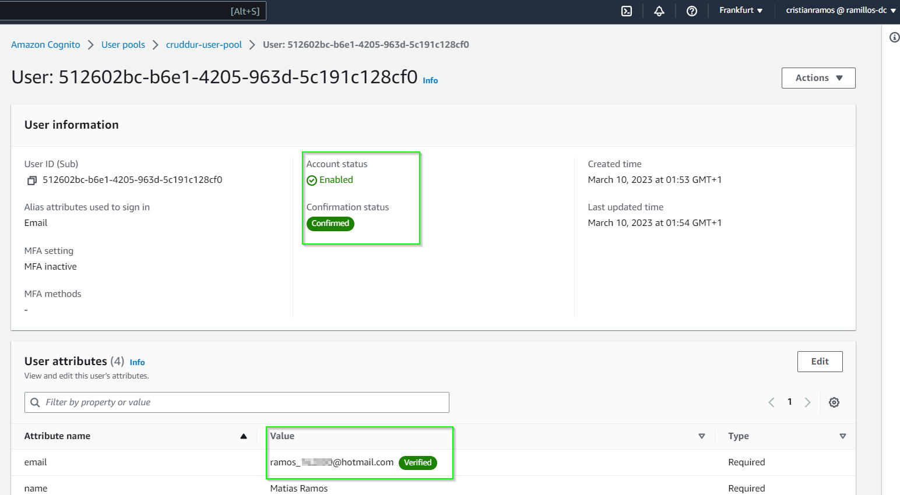</p>

5. Sign in with the new account:

<p align="center">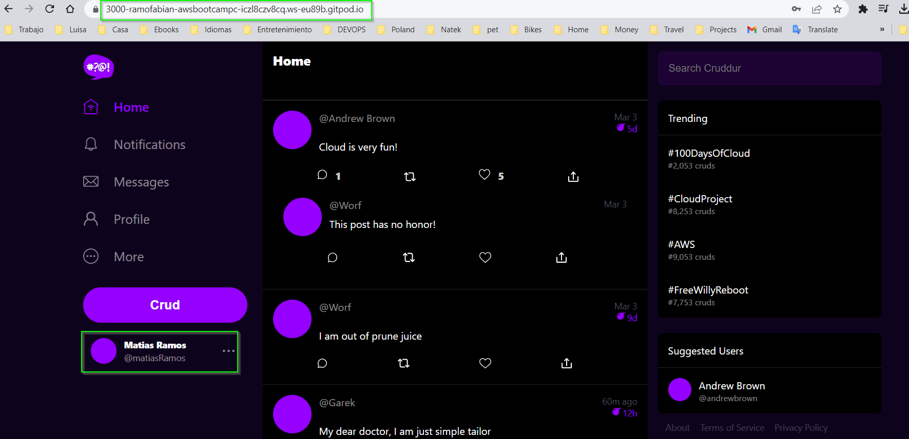</p>

<b>Link to file:</b>
* [ConfirmationPage.js](https://github.com/ramofabian/aws-bootcamp-cruddur-2023/blob/main/frontend-react-js/src/pages/ConfirmationPage.js)

### Implement Custom Recovery Page
:white_check_mark: DONE. I didn't have any issue to follow Andrew's instructions.

To implment the recovery page I have followed the next instructions:

1. Add the following code in `RecoverPage.js` page located in `frontend-react-js/src/pages/`

```js
// Cognito
import { Auth } from 'aws-amplify';

const onsubmit_send_code = async (event) => {
    event.preventDefault();
    setErrors('')
    Auth.forgotPassword(username)
    .then((data) => setFormState('confirm_code') )
    .catch((err) => setErrors(err.message) );
    return false
}

// cognito
const onsubmit_confirm_code = async (event) => {
    event.preventDefault();
    setErrors('')
    if (password == passwordAgain){
      Auth.forgotPasswordSubmit(username, code, password)
      .then((data) => setFormState('success'))
      .catch((err) => setErrors(err.message) );
    } else {
      setErrors('Passwords do not match')
    }
    return false
  }
```
2. Adding email in recovery password page:

<p align="center">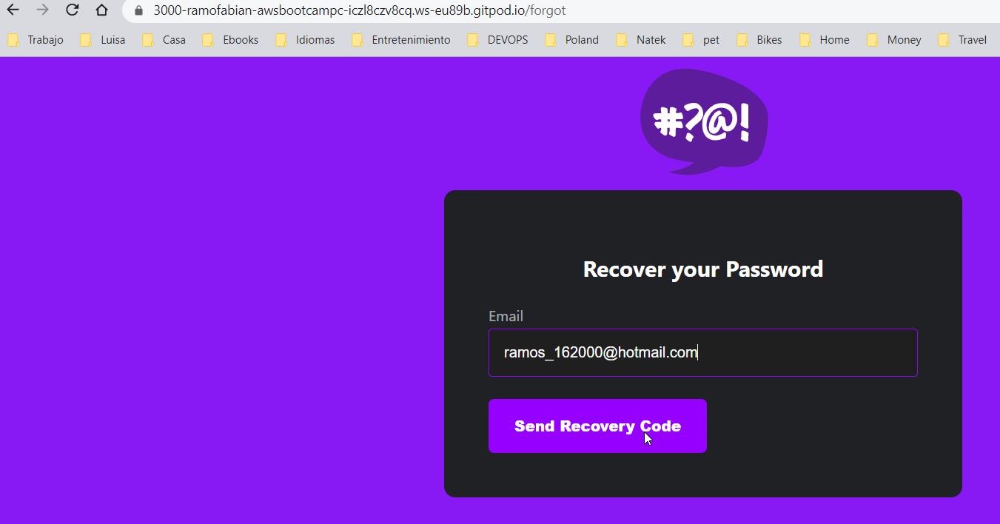</p>

3. Email received:

<p align="center">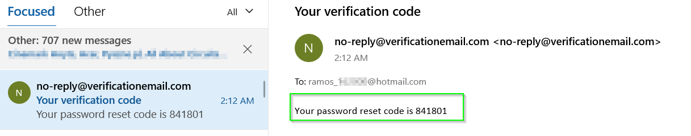</p>

4. Code and new password set:

<p align="center">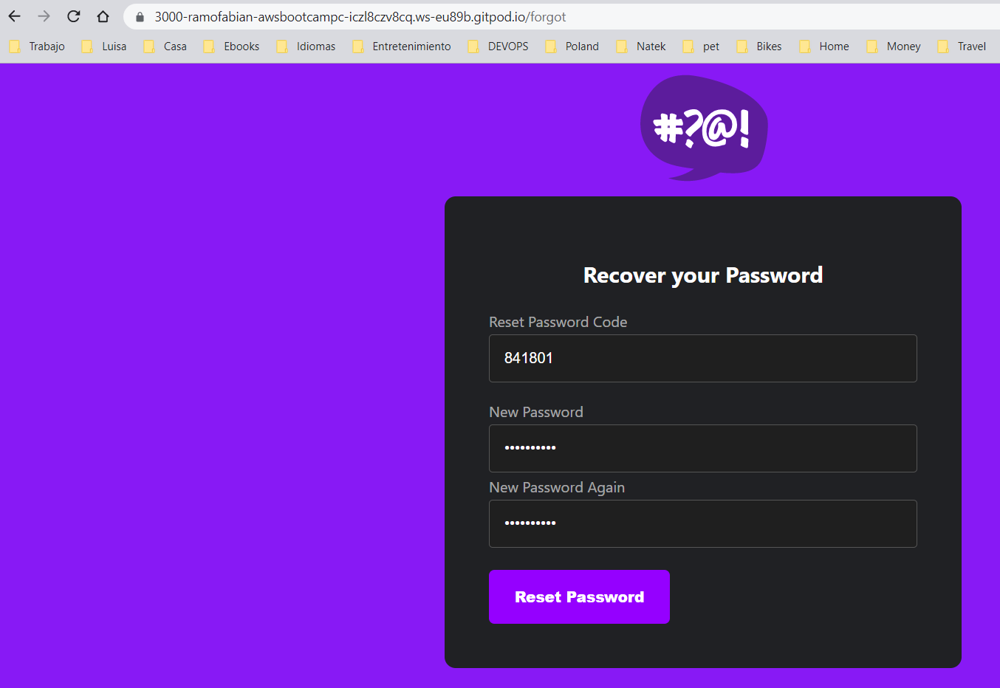</p>

5. New password saved confirmation:

<p align="center">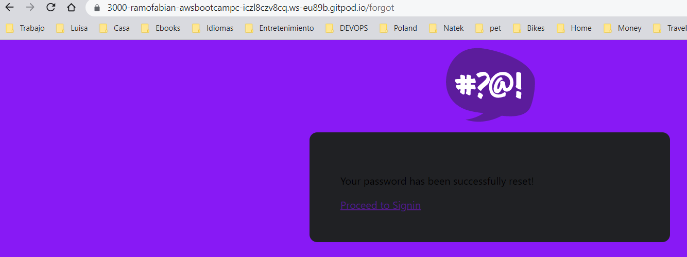</p>

<b>Link to file:</b>
* [RecoverPage.js](https://github.com/ramofabian/aws-bootcamp-cruddur-2023/blob/main/frontend-react-js/src/pages/RecoverPage.js)

#### JWTs server side
:white_check_mark: DONE. I didn't have any issue to follow Andrew's instructions.

To implment the JWT on the server side I have followed the next instructions:

1. Add the following code in `HomeFeedPage.js` page in the directory `/frontend-react-js/src/pages/`:

```js
const res = await fetch(backend_url, {
        headers: {
          Authorization: `Bearer ${localStorage.getItem("access_token")}`
        },
        method: "GET"
      });
```

2. Go to backend and add the following code in `app.py` file:

```py
#JWTs for frontend integration with cognito -------------------------
cors = CORS(
  app, 
  resources={r"/api/*": {"origins": origins}},
  headers=['Content-Type', 'Authorization'], 
  expose_headers='Authorization',
  methods="OPTIONS,GET,HEAD,POST"
)

#get access token from frontend -------------------------
@app.route("/api/activities/home", methods=['GET'])
#@xray_recorder.capture('activities_home') # X-ray turned off for spend reasons on Cloudwatch
def data_home():
  app.logger.info('AUTH HEADER-------') 
  app.logger.info(request.headers.get('Authorization'))
  data = HomeActivities.run()
  #loggger turned off for spend reasons on Cloudwatch
  #data = HomeActivities.run(logger=LOGGER)
  return data, 200
```

3. Install python packet `Flask-AWSCognito` with the command `pip install -r requirements.txt`.
4. Go to `docker-compose.yml` file and add env variables in backend service.

```yml
AWS_COGNITO_USER_POOL_ID: "eu-central-1_b8JxxxoLP"
AWS_COGNITO_USER_POOL_CLIENT_ID: "1qjcgh0p91vqgxxxxxk6ra8q"
```

5. Add the following code in `app.py` file:

```py
#AWS Cognito service side ---------------------
from lib.cognito_jwt_token import CognitoJwtToken, extract_access_token, TokenVerifyError

app = Flask(__name__)

#AWS Cognito service side ---------------------
cognito_jwt_token = CognitoJwtToken(
  user_pool_id=os.getenv("AWS_COGNITO_USER_POOL_ID"), 
  user_pool_client_id=os.getenv("AWS_COGNITO_USER_POOL_CLIENT_ID"),
  region=os.getenv("AWS_DEFAULT_REGION")
)

@app.route("/api/activities/home", methods=['GET'])
def data_home():
  access_token = extract_access_token(request.headers)
  try:
    claims = cognito_jwt_token.verify(access_token)
    # authenicatied request
    app.logger.debug("authenicated")
    app.logger.debug(claims)
    app.logger.debug(claims['username'])
    data = HomeActivities.run(cognito_user_id=claims['username'])
  except TokenVerifyError as e:
    # unauthenicatied request
    app.logger.debug(e)
    app.logger.debug("unauthenicated")
    data = HomeActivities.run()
  return data, 200
 ```
 
 6. Add the following code on `home_activities.py` from directory `backend-flask/services/`:
 
 ```py
 def run(cognito_user_id=None):
  #--- ommiting code for simplicity
  if cognito_user_id != None:
        extracrud = {
        'uuid': '248959df-3079-4947-b847-9e0892d1bab4',
        'handle':  'Lore',
        'message': 'My dear brother, it the humas are the problem',
        'created_at': (now - timedelta(hours=1)).isoformat(),
        'expires_at': (now + timedelta(hours=12)).isoformat(),
        'likes': 0,
        'replies': []
        }
        results.insert(0, extracrud)
   return results
 ```
 
 6. Add the following code on `ProfileInfo.js` from directory `frontend-react-js/src/components/`:
 
 ```js
 const signOut = async () => {
    try {
        await Auth.signOut({ global: true });
        window.location.href = "/"
        localStorage.removeItem("access_token") //New line to remove local storage
    } catch (error) {
        console.log('error signing out: ', error);
    }
  }
 ```
 Logs seen during web browser interation
 
 <p align="center">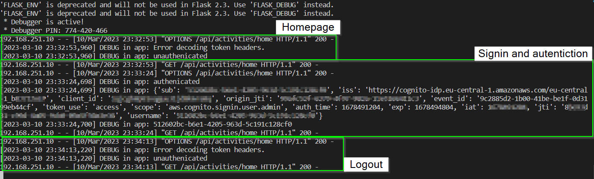</p>

<b>Link to files:</b>
* [HomeFeedPage.js](https://github.com/ramofabian/aws-bootcamp-cruddur-2023/blob/main/frontend-react-js/src/pages/HomeFeedPage.js)
* [app.py](https://github.com/ramofabian/aws-bootcamp-cruddur-2023/blob/main/backend-flask/app.py)
* [requirements.txt](https://github.com/ramofabian/aws-bootcamp-cruddur-2023/blob/main/backend-flask/requirements.txt)
* [home_activities.py](https://github.com/ramofabian/aws-bootcamp-cruddur-2023/blob/main/backend-flask/services/home_activities.py)
* [ProfileInfo.js](https://github.com/ramofabian/aws-bootcamp-cruddur-2023/blob/main/frontend-react-js/src/components/ProfileInfo.js)

### Watch about different approaches to verifying JWTs
:white_check_mark: DONE.

### Watch Improving UI Contrast and Implementing CSS Variables for Theming
:white_check_mark: DONE. I have some adjustes to UI to make it more readable.

- Home page:

 <p align="center">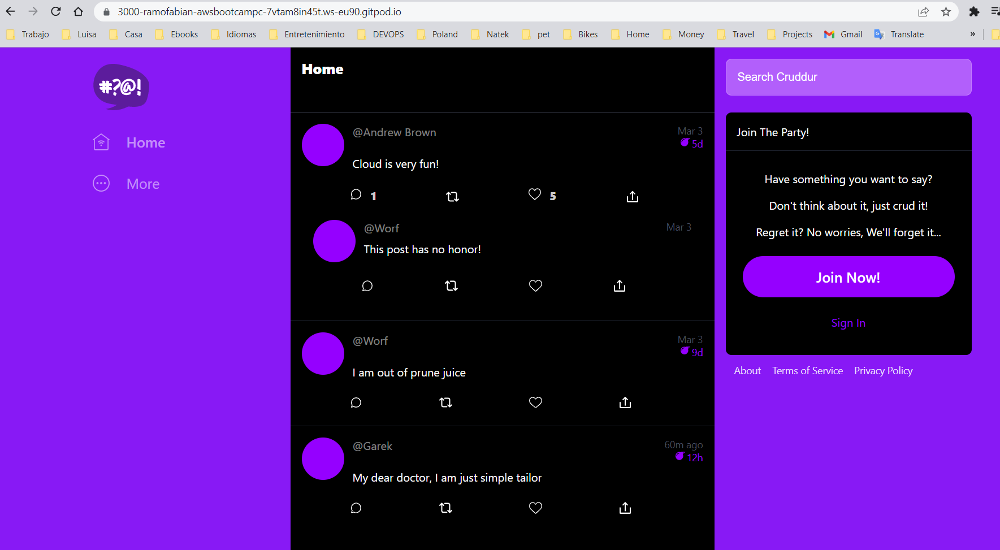</p>

- Home page after sign in:

 <p align="center">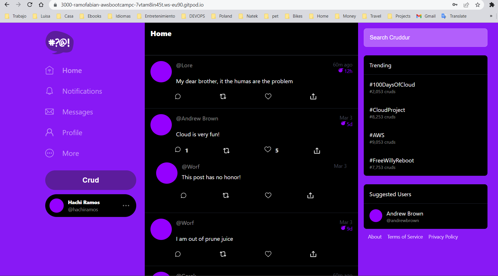</p>

- Notifications:
                      
 <p align="center">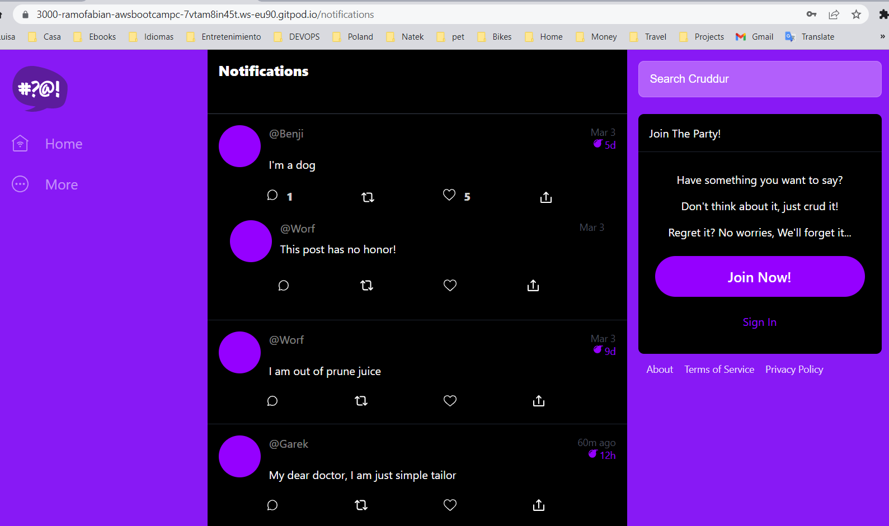</p>
