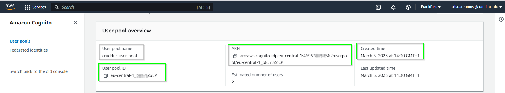

# Week 3 — Decentralized Authentication
## Mandatory tasks
### Watched Ashish's Week 3 - Decenteralized Authentication	
:white_check_mark: DONE.
### Watch Chirag Week 3 - Spending Considerations	
### Setup Cognito User Pool	
:white_check_mark: DONE. I had some issues with the user pool and I had to recreated it a couple times, becuase I had missed some features to make it work properly.

The following parameters were used create the user pool correctly via web from AWS Cognito for ours Cruddur application:
```
* User pool name: cruddur-user-pool
* provider option: Cognito user pool (default)
* Cognito user pool sign-in: email
* Multi-factor autenticator: No MFA
* User account recovery: Enable self-service account recovery and email only
* Required attributes: name and preferred_username
* Email: Send email with Cognito
* Integrate your app (User pool name): cruddur-user-pool
* Initial app client: Public client
* App client name: cruddur
```

- Please find below the user pool created:

<p align="center"></p>

- Created users:
 
<p align="center"></p>

- With the command `aws cognito-idp list-user-pools --max-results 20`

<p align="center"></p>

- With the command `aws cognito-idp describe-user-pool --user-pool-id <<user_pool_id>>` the user pool configuration can be seen from AWS CLI

- With the command `aws cognito-idp list-user-pool-clients --user-pool-id <<user_pool_id>>` the app client are listed:

<p align="center"></p>

- With this command the created users under `cruddur-user-pool` administration `aws cognito-idp list-users --user-pool-id <<user_pool_id>>`

<p align="center"></p>

<b>References:</b> [AWS CLI Reference](https://docs.aws.amazon.com/cli/latest/index.html) and [AWS web tutotial](https://docs.aws.amazon.com/cognito/latest/developerguide/tutorial-create-user-pool.html)

### Implement Custom Signin Page
:white_check_mark: DONE.  I didn't have issues to follow Andrew's video, it was really interesting task because I haven used Amplify before.

To connect frontend with AWS Cognito we are using `Amplify` (<b>Definition:</b> It is an open-source solution that lets frontend developers builds, ship and host full stack applications on AWS). The following procedure was performed to implment custom signin page:

1. Run the command `npm i aws-amplify --save` to install the dependecy in `npm` and automatically save it on `aws-bootcamp-cruddur-2023/frontend-react-js/package.json` for future works in the comming weeks.
2. Add the following code in the file `/aws-bootcamp-cruddur-2023/frontend-react-js/src/App.js` to configure `amplify` and hook up our cognito pool to our frontend code:

```js
// Amplify --------------------------
import { Amplify } from 'aws-amplify';

Amplify.configure({
  "AWS_PROJECT_REGION": process.env.REACT_AWS_PROJECT_REGION,
  //"aws_cognito_identity_pool_id": process.env.REACT_APP_AWS_COGNITO_IDENTITY_POOL_ID, //NOT required
  "aws_cognito_region": process.env.REACT_APP_AWS_COGNITO_REGION,
  "aws_user_pools_id": process.env.REACT_APP_AWS_USER_POOLS_ID,
  "aws_user_pools_web_client_id": process.env.REACT_APP_CLIENT_ID,
  "oauth": {},
  Auth: {
    // We are not using an Identity Pool
    // identityPoolId: process.env.REACT_APP_IDENTITY_POOL_ID, // REQUIRED - Amazon Cognito Identity Pool ID
    region: process.env.REACT_AWS_PROJECT_REGION,           // REQUIRED - Amazon Cognito Region
    userPoolId: process.env.REACT_APP_AWS_USER_POOLS_ID,         // OPTIONAL - Amazon Cognito User Pool ID
    userPoolWebClientId: process.env.REACT_APP_CLIENT_ID,   // OPTIONAL - Amazon Cognito Web Client ID (26-char alphanumeric string)
  }
});
```

3. Add the following envariable variables in to frontend service in `docker-compose.yml` file:

```yml
REACT_AWS_PROJECT_REGION: "${AWS_DEFAULT_REGION}"
REACT_APP_AWS_COGNITO_REGION: "${AWS_DEFAULT_REGION}"
REACT_APP_AWS_USER_POOLS_ID: "eu-central-1_b8xxxxoLP"
REACT_APP_CLIENT_ID: "1qjcgh0pxxxxxxxxxxd8k6ra8q"
```

4. Go to `HomeFeedPage.js` file and add the following code to enable autentication on this page and don't forget comment or remove the cookies code:

```js
// congnito ------------------
import { Auth } from 'aws-amplify';

const [user, setUser] = React.useState(null);

// cognito -----------------
// check if we are authenicated
  const checkAuth = async () => {
    Auth.currentAuthenticatedUser({
      // Optional, By default is false. 
      // If set to true, this call will send a 
      // request to Cognito to get the latest user data
      bypassCache: false 
    })
    .then((user) => {
      console.log('user',user);
      return Auth.currentAuthenticatedUser()
    }).then((cognito_user) => {
        setUser({
          display_name: cognito_user.attributes.name,
          handle: cognito_user.attributes.preferred_username
        })
    })
    .catch((err) => console.log(err));
  };
  
  React.useEffect(()=>{
    //prevents double call
    if (dataFetchedRef.current) return;
    dataFetchedRef.current = true;

    loadData();
    checkAuth();
  }, [])
  
// Pass user to the following components
<DesktopNavigation user={user} active={'home'} setPopped={setPopped} />
<DesktopSidebar user={user} />
```

5. Add the folllwoing code in `ProfileInfo.js` and don't forget comment or remove the cookies code: 

```js
import { Auth } from 'aws-amplify';

const signOut = async () => {
  try {
      await Auth.signOut({ global: true });
      window.location.href = "/"
  } catch (error) {
      console.log('error signing out: ', error);
  }
}
```

6. Adding the code below in `SigninPage.js` and don't forget comment or remove the cookies code: 

- We get an access token from AWS API and use it to login

```js
// cognito
import { Auth } from 'aws-amplify';

// Cognito sign
  const onsubmit = async (event) => {
    setErrors('')
    event.preventDefault();
    Auth.signIn(email, password)
      .then(user => {
        console.log('user!', user) 
        localStorage.setItem("access_token", user.signInUserSession.accessToken.jwtToken)
        window.location.href = "/"
      })
      .catch(error => { 
        console.log('Error!', error) //prompt the error in cli
        if (error.code == 'UserNotConfirmedException') {
          window.location.href = "/confirm"
        }
        setErrors(error.message)
      });
    return false
  }
```

7. Login with an unknown email and password, the following error must be seen and from webpage the error: `Incorrect username or password.` must be displayed:

<p align="center"></p>

The folllowing command is used to force some account to be in authorized state:

```bash
aws cognito-idp admin-set-user-password --user-pool-id <<user_pool_id>> --username <<user_name>> --password <<pass>> --permanent
```

<p align="center"></p>

Sigin with correct credentials and the user has been validated:

<p align="center"></p>

<b>Link to files:</b>
* [package.json](https://github.com/ramofabian/aws-bootcamp-cruddur-2023/blob/main/frontend-react-js/package.json)
* [App.js](https://github.com/ramofabian/aws-bootcamp-cruddur-2023/blob/main/frontend-react-js/src/App.js)
* [docker-compose.yml](https://github.com/ramofabian/aws-bootcamp-cruddur-2023/blob/main/docker-compose.yml)
* [HomeFeedPage.js](https://github.com/ramofabian/aws-bootcamp-cruddur-2023/blob/main/frontend-react-js/src/pages/HomeFeedPage.js)
* [ProfileInfo.js](https://github.com/ramofabian/aws-bootcamp-cruddur-2023/blob/main/frontend-react-js/src/components/ProfileInfo.js)
* [SigninPage.js](https://github.com/ramofabian/aws-bootcamp-cruddur-2023/blob/main/frontend-react-js/src/pages/SigninPage.js)

### Implement Custom Signup Page
### Implement Custom Confirmation Page
### Implement Custom Recovery Page
### Watch about different approaches to verifying JWTs
