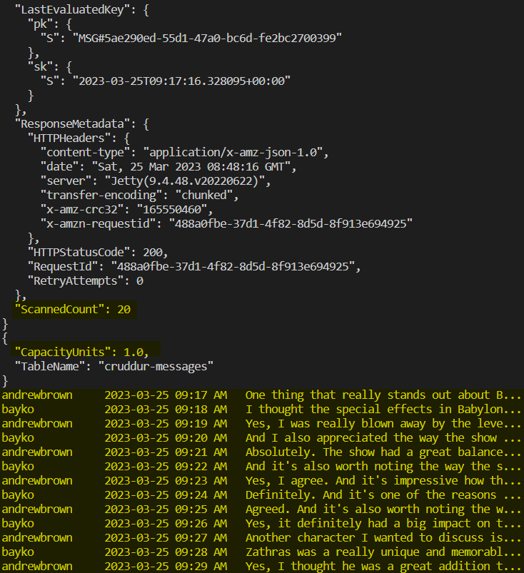

# Week 5 — DynamoDB and Serverless Caching
## Mandatory tasks
### Watched Week 5 - Data Modelling (Live Stream)
:white_check_mark: DONE.
### Watched Ashish's Week 5 - DynamoDB Considerations
:white_check_mark: DONE.
### Implement Schema Load Script
:white_check_mark: DONE. I didn't have any issue to follow Andre's instructions.

To implement the schema load script, it is requiered the following steps:
1. Add `boto3` lib into `requirements.txt` within `backend-flask` folder. Then run the command `pip install -r requirements.txt`.
2. Switch on the containers and make sure dynamoDB  container is working.
2. Create `schema-load` python script and place it in `backend-flask/bin/ddb/`. This script will connect to local or remote DynamoDB database, then it will create a table called `cruddur-messages`.

```python
#!/usr/bin/env python3

import boto3
import sys

attrs = {
    'endpoint_url': 'http://localhost:8000'
}

# Checking if the prod word was entered as a arg
if len(sys.argv) == 2:
    if "prod" in sys.argv[1]:
        attrs = {}

# Start conection to dynamoDB
ddb = boto3.client('dynamodb', **attrs)

table_name = 'cruddur-messages'

# Creating table the 'cruddur-messages'
response = ddb.create_table(
    TableName=table_name,
    AttributeDefinitions=[
        {
            'AttributeName': 'pk',
            'AttributeType': 'S'
        },
        {
            'AttributeName': 'sk',
            'AttributeType': 'S'
        },
    ],
    KeySchema=[
        {
            'AttributeName': 'pk',
            'KeyType': 'HASH'
        },
        {
            'AttributeName': 'sk',
            'KeyType': 'RANGE'
        },
    ],
    BillingMode='PROVISIONED',
    ProvisionedThroughput={
        'ReadCapacityUnits': 5,
        'WriteCapacityUnits': 5
    },
)
print(response)
```

3. Create `list-tables` bash script to see if the table has been cretaed, it should be placed it in side of `backend-flask/bin/ddb/`.

```bash
#! /usr/bin/bash
set -e # stop if it fails at any point

CYAN='\033[1;36m'
NO_COLOR='\033[0m'
LABEL="list-tables"
printf "${CYAN}== ${LABEL}${NO_COLOR}\n"

#Check if the conection URL is prod or dev
if [ "$1" = "prod" ]; then
    ENDPOINT_URL=""
else
    ENDPOINT_URL="--endpoint-url=http://localhost:8000"
fi

#get the list of tables via AWS command
aws dynamodb list-tables $ENDPOINT_URL \
--query TableNames \
--output table
```

4. Create `drop` bash script to make the table removal and place it in side of `backend-flask/bin/ddb/`.

```bash
#! /usr/bin/bash
set -e # stop if it fails at any point

CYAN='\033[1;36m'
NO_COLOR='\033[0m'
LABEL="Drop"
printf "${CYAN}== ${LABEL}${NO_COLOR}\n"

# ./db/ddb/drop cruddur-messages prod

#Check if the conection URL is prod or dev
if [ -z "$1" ]; then
    echo "No TABLE_NAME argument supplied eg ./db/ddb/drop cruddur-messages prod"
    exit 1
fi

TABLE_NAME=$1

if [ "$2" = "prod" ]; then
    ENDPOINT_URL=""
else
    ENDPOINT_URL="--endpoint-url=http://localhost:8000"
fi

echo "Deleting table: $TABLE_NAME"

#get the list of tables via AWS command
aws dynamodb delete-table $ENDPOINT_URL \
--table-name $TABLE_NAME
```

5. Execution logs:
5.1. Executing `schema-load`:

<p align="center"></p>

5.2. Executing `list-tables`:

<p align="center"></p>

5.3. Executing `drop`:

<p align="center"></p>

<b>Link to files:</b>
- [schema-load](https://github.com/ramofabian/aws-bootcamp-cruddur-2023/blob/main/backend-flask/bin/ddb/schema-load)
- [list-tables](https://github.com/ramofabian/aws-bootcamp-cruddur-2023/blob/main/backend-flask/bin/ddb/list-tables)
- [drop](https://github.com/ramofabian/aws-bootcamp-cruddur-2023/blob/main/backend-flask/bin/ddb/drop)

### Implement Seed Script
:white_check_mark: DONE. I didn't have any issue to follow Andre's instructions.

To implement the Seed script, we have to create `seed` python script and place it in `backend-flask/bin/ddb/`. This script has hardcoded a conversation which is parsed which it saves into local DynamoDB table by using the the `patterm C` (new conversation). 

<p align="center"></p>

To carry on this work the script performs the following instructions:
1. Extract `handles` from postgres DB.
2. Create Message groups in `cruddur-messages` table by using the `pattern C` from DB model.
3. Prase the conversations.
4. Create the Mesasses and associate it to Message group in `cruddur-messages`.

Link to file: [seed](https://github.com/ramofabian/aws-bootcamp-cruddur-2023/blob/main/backend-flask/bin/ddb/seed)

Execution log:

<p align="center"></p>

### Implement Scan Script
:white_check_mark: DONE. I didn't have any issue to follow Andre's instructions.

To implement the Scan script, we have to create `seed` python script and place it in `backend-flask/bin/ddb/`. This script connects to dynamoDB and gather all information from `cruddur-messages` table.

```python
#!/usr/bin/env python3

import boto3
import sys

attrs = {
  'endpoint_url': 'http://localhost:8000'
}
# unset endpoint url for use with production database
if len(sys.argv) == 2:
  if "prod" in sys.argv[1]:
    attrs = {}
dynamodb = boto3.resource('dynamodb',**attrs)
table_name = 'cruddur-messages'

#Run the scan
table = dynamodb.Table(table_name)
response = table.scan()

# Print the scan
print("="*20)
print(response)
print("="*20)
items = response['Items']
for item in items:
    print(item)
```

Link to file: [scan](https://github.com/ramofabian/aws-bootcamp-cruddur-2023/blob/main/backend-flask/bin/ddb/scan)

Execution log:

<p align="center"></p>

### Implement Pattern Scripts for Read and List Conversations
:white_check_mark: DONE. This part was hard to follow up, because I got lost in many part of it. Although, I could make it :)

#### Implementing get-conversation script
To implement the Scan script, we have to create `get-conversation` python script and place it in `backend-flask/bin/ddb/patterns`. This script connects to dynamoDB, makes a query to get the info of some determinated message group ID within a determinated period of time and parses this information.

```python
#!/usr/bin/env python3

import boto3
import sys
import json
import datetime

attrs = {
  'endpoint_url': 'http://localhost:8000'
}

if len(sys.argv) == 2:
  if "prod" in sys.argv[1]:
    attrs = {}

dynamodb = boto3.client('dynamodb',**attrs)
table_name = 'cruddur-messages'

message_group_uuid = "5ae290ed-55d1-47a0-bc6d-fe2bc2700399"

# define the query parameters
query_params = {
  'TableName': table_name,
#   'KeyConditionExpression': 'pk = :pk AND begins_with(sk,:year)',              # filter paramater
  'KeyConditionExpression': 'pk = :pk AND sk between :start_date AND :end_date', # filter paramater
  'ScanIndexForward': False,                                                     # send in desending direction
  'Limit': 20,                                                                   # Limt of items to be returned
  'ExpressionAttributeValues': {
    ':pk': {'S': f"MSG#{message_group_uuid}"},                                   # partition key == MSG#{message_group_uuid}
    ':start_date': {'S': "2023-03-01T00:00:00.000000+00:00"},
    ':end_date': {'S': "2023-03-30T23:38:15.735541+00:00"},
    # ':year': {'S': '2023'}
  },
  'ReturnConsumedCapacity': 'TOTAL'
}

# query the table
response = dynamodb.query(**query_params)

# print the items returned by the query
print(json.dumps(response, sort_keys=True, indent=2))

# print the consumed capacity
print(json.dumps(response['ConsumedCapacity'], sort_keys=True, indent=2))

items = response['Items']
reversed_array = items[::-1]              # showing the messages in ascending order

for item in reversed_array:
  sender_handle = item['user_handle']['S']
  message       = item['message']['S']
  timestamp     = item['sk']['S']
  dt_object = datetime.datetime.strptime(timestamp, '%Y-%m-%dT%H:%M:%S.%f%z')
  formatted_datetime = dt_object.strftime('%Y-%m-%d %I:%M %p')
  print(f'{sender_handle: <16}{formatted_datetime: <22}{message[:40]}...')
```

Link to file: [get-converstations](https://github.com/ramofabian/aws-bootcamp-cruddur-2023/blob/main/backend-flask/bin/ddb/patterns/get-converstations)

Execution log:

<p align="center"></p>

<p align="center"></p>

#### Implementing get-conversation script
To implement the Scan script, we have to create `list-conversation` python script and place it in `backend-flask/bin/ddb/patterns`. This script connects to dynamoDB, makes a query to get the info of some determinated group message ID within and consumed capacity.

```python
#!/usr/bin/env python3

import boto3
import sys
import json
import os

current_path = os.path.dirname(os.path.abspath(__file__))
parent_path = os.path.abspath(os.path.join(current_path, '..', '..', '..'))
sys.path.append(parent_path)
from lib.db import db

attrs = {
  'endpoint_url': 'http://localhost:8000'
}

if len(sys.argv) == 2:
  if "prod" in sys.argv[1]:
    attrs = {}

dynamodb = boto3.client('dynamodb',**attrs)
table_name = 'cruddur-messages'

def get_my_user_uuid():
    #Query to get the user UUID from local postgres DB
    sql = """
    SELECT 
        users.uuid
    FROM users
    WHERE
        users.handle = %(handle)s
    """
    uuid = db.query_array_json(sql,{
    'handle':  'andrewbrown'
    })
    return uuid[0]['uuid']

my_user_uuid = get_my_user_uuid()
print(f"my-uuid: {my_user_uuid}\n")

# define the query parameters
query_params = {
  'TableName': table_name,
  'KeyConditionExpression': 'pk = :pk',
  'ExpressionAttributeValues': {
    ':pk': {'S': f"GRP#{my_user_uuid}"}
  },
  'ReturnConsumedCapacity': 'TOTAL' # to see the spending
}

# query the table
response = dynamodb.query(**query_params)

# print the items returned by the query
print(json.dumps(response, sort_keys=True, indent=2))
```

Link to file: [list-converstations](https://github.com/ramofabian/aws-bootcamp-cruddur-2023/blob/main/backend-flask/bin/ddb/patterns/list-converstations)

Execution log:

<p align="center"></p>

<p align="center"></p>

### Implement Update Cognito ID Script for Postgres Database
### Implement (Pattern A) Listing Messages in Message Group into Application
### Implement (Pattern B) Listing Messages Group into Application
### Implement (Pattern C) Listing Messages Group into Application
### Implement (Pattern D) Listing Messages Group into Application
### Implement (Pattern E) Listing Messages Group into Application
