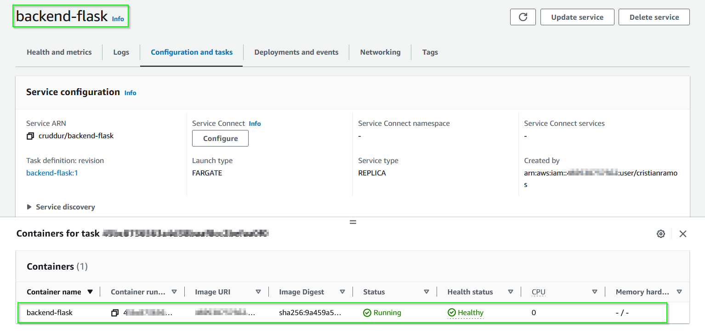
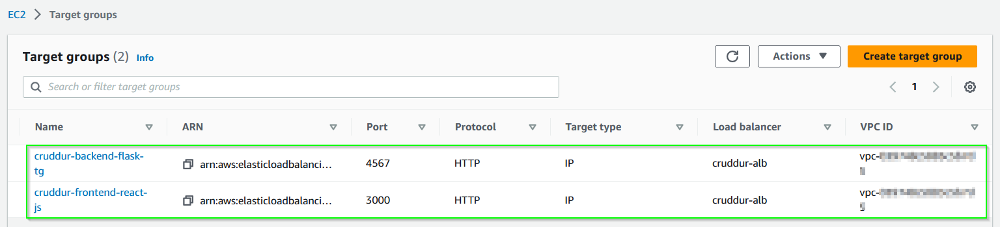

# Week 6 — Deploying Containers
## Mandatory tasks
### Watched Ashish's Week 6 - Amazon ECS Security Best Practices
:white_check_mark: DONE.
### Watched ECS Fargate (Part 1)
:white_check_mark: DONE.
### Forecast cost of Fargate
:white_check_mark: DONE.
In we worst case if we have 2 containers running every day for the whole month the cost will be arround 20USD. This forecast has been done with AWS calculator and using the parameters below:

```
- Region: Europe (Frankfurt)
- OS: Linux
- CPU Architecture: x86
- Number of tasks: 2 per month
- Average duration: 730 hours (1 month)
- Amount of vCPU allocated: 0.25 vCPU
- Amount of memory allocated: 0.5 GB
- Amount of ephemeral storage allocated for Amazon ECS: 20 GB
```

Log output:

<p align="center"></p>

### Creating healthchecks
:white_check_mark: DONE.
#### Healthcheck RDS connection
Script to test the connection to AWS RDS DB, this script will be named as `test` and will be placed in `backend-flask/bin/db/`

```py
#!/usr/bin/env python3

import psycopg
import os
import sys

connection_url = os.getenv("CONNECTION_URL")

conn = None
try:
  print('attempting connection')
  conn = psycopg.connect(connection_url)
  print("Connection successful!")
except psycopg.Error as e:
  print("Unable to connect to the database:", e)
finally:
  conn.close()
```

Then fix the permissions:

```bash
gitpod /workspace/aws-bootcamp-cruddur-2023/backend-flask (main) $ chmod u+x bin/db/test 
gitpod /workspace/aws-bootcamp-cruddur-2023/backend-flask (main) $ ls -la bin/db/test 
-rwxr--r-- 1 gitpod gitpod 331 Apr  1 09:31 bin/db/test
```

Execute python `test` to test if RDS DB is alive and conection stablished, `./bin/db/test`:

<p align="center"></p>

#### Healthcheck endpoint for Flask
1. In `backend-flask\app.py` we need to add a new endpoint with the route `/api/health-check` and returns 200 message as success.

```py
# Flask healthcheck
@app.route('/api/health-check')
def health_check():
  return {'success': True}, 200
```

2. Then we need to create a python scritp at `bin/flask/health-check` with the code below:

```py
#!/usr/bin/env python3

import urllib.request

try:
  response = urllib.request.urlopen('http://localhost:4567/api/health-check')
  if response.getcode() == 200:
    print("[OK] Flask server is running")
    exit(0) #succed message
  else:
    print("[BAD] Flask server is not running")
    exit(1) #fail message
except Exception as e:
    print("[BAD] ", e)
    exit(1) #fail message
```

3. Fix the permissions `chmod u+x bin/flask/health-check` and run the script (first try not succeded becuase local postgres DB was not running):

<p align="center"></p>

4. Create new logs groups in AWS with the follwing commands:

```bash
aws logs create-log-group --log-group-name "cruddur-fargate-cluster"
aws logs put-retention-policy --log-group-name "cruddur-fargate-cluster" --retention-in-days 1
```

<b>Note:</b> The information will be retained 1 day only, then it will be removed by the system itself.

<p align="center"></p>

### Provision ECS Cluster
:white_check_mark: DONE.
To create the ECS cluster from AWS CLI we have to run the following command:

```bash
aws ecs create-cluster \
--cluster-name cruddur \
--service-connect-defaults namespace=cruddur
```

In the picture below is shown the ECS cluster created from previous command (it is empty, so no services attached):

<p align="center"></p>

### Create ECR repo and push image for backend-flask
:white_check_mark: DONE.
#### Storing ours containers on ECR
We are going to store ours containers as private and it will be done from Gitpod console.

There is going to be 3 repos:
- Base-image python.
- Flask.
- React.

##### 1. Create `cruddur-python` repo as mutable from Gitpod CLI:

```bash
aws ecr create-repository \
  --repository-name cruddur-python \
  --image-tag-mutability MUTABLE
```

- Created repo seen from AWS console:

<p align="center"></p>

- Get logged in AWS ECR from gitpod CLI:

```bash
aws ecr get-login-password --region $AWS_DEFAULT_REGION | docker login --username AWS --password-stdin "$AWS_ACCOUNT_ID.dkr.ecr.$AWS_DEFAULT_REGION.amazonaws.com"
```

Execution log:

<p align="center"></p>

- Set the repo URL with the command below and confirm that this information matched with the one in AWS console:

```bash
export ECR_PYTHON_URL="$AWS_ACCOUNT_ID.dkr.ecr.$AWS_DEFAULT_REGION.amazonaws.com/cruddur-python"
echo $ECR_PYTHON_URL
```

Execution logs:

<p align="center"></p>

- Pull, tag and push docker image in our AWS repo:

```bash
docker pull python:3.10-slim-buster
docker tag python:3.10-slim-buster $ECR_PYTHON_URL:3.10-slim-buster
docker push $ECR_PYTHON_URL:3.10-slim-buster
```
Logs from CLI:

<p align="center"></p>

Logs AWS console:

<p align="center"></p>

After running the db and backend service, we see the flask healthcheck is workig:

<p align="center"></p>

##### 2. Create `bakend-flask` repo as mutable from Gitpod CLI:

```bash
#Create repo
aws ecr create-repository \
  --repository-name backend-flask \
  --image-tag-mutability MUTABLE
  
#Create connection URL
export ECR_BACKEND_FLASK_URL="$AWS_ACCOUNT_ID.dkr.ecr.$AWS_DEFAULT_REGION.amazonaws.com/backend-flask"
echo $ECR_BACKEND_FLASK_URL
```
Log from AWS console:

<p align="center"></p>

Log from gitpod CLI:

<p align="center"></p>

- Build, tag and push docker image in our AWS repo:

```bash
cd /workspace/aws-bootcamp-cruddur-2023/backend-flask
docker build -t backend-flask .
docker tag backend-flask:latest $ECR_BACKEND_FLASK_URL:latest
docker push $ECR_BACKEND_FLASK_URL:latest
```
Logs from gitpod cli:

<p align="center"></p>

Image seen from AWS repo:

<p align="center"></p>

### Deploy Backend Flask app as a service to Fargate
:white_check_mark: DONE.
To deploy backend flask app in Fargate, it is necessary to follow the next steps:
#### Implement parameters
1. Load enviroment variables to AWS Application Management paramater store

```bash
aws ssm put-parameter --type "SecureString" --name "/cruddur/backend-flask/AWS_ACCESS_KEY_ID" --value $AWS_ACCESS_KEY_ID
aws ssm put-parameter --type "SecureString" --name "/cruddur/backend-flask/AWS_SECRET_ACCESS_KEY" --value $AWS_SECRET_ACCESS_KEY
aws ssm put-parameter --type "SecureString" --name "/cruddur/backend-flask/CONNECTION_URL" --value $PROD_CONNECTION_URL
aws ssm put-parameter --type "SecureString" --name "/cruddur/backend-flask/ROLLBAR_ACCESS_TOKEN" --value $ROLLBAR_ACCESS_TOKEN
aws ssm put-parameter --type "SecureString" --name "/cruddur/backend-flask/OTEL_EXPORTER_OTLP_HEADERS" --value "x-honeycomb-team=$HONEYCOMB_API_KEY"
```

<p align="center"></p>

2. From AWS console go to -> AWS Systems Manager -> Application Management -> Parameter Store to see the loaded parameters:

<p align="center"></p>

#### Implement AWS service policy
AIM roles are needed for Fargate task definition, we need to do:
- create a new `role` in AIM service called `CruddurServiceExecutionRole` with the json configuration in this file :point_right: [aws/policies/service-assume-role-execution-policy.json](https://github.com/ramofabian/aws-bootcamp-cruddur-2023/blob/main/aws/policies/service-assume-role-execution-policy.json)
- create a new `policy` in AIM service called `CruddurServiceExecutionPolicy` with the json configuration and this policy is assigned to the role previously created. :point_right: [aws/policies/service-execution-policy.json](https://github.com/ramofabian/aws-bootcamp-cruddur-2023/blob/main/aws/policies/service-execution-policy.json)

The execution was done with AWS CLI with the command below:

```bash

#Creating the role
aws iam create-role \
--role-name CruddurServiceExecutionRole  \
--assume-role-policy-document file://aws/policies/service-assume-role-execution-policy.json

#Creating the policy and putting the assiidination to the role previously created
aws iam put-role-policy \
--role-name CruddurServiceExecutionRole \
--policy-name CruddurServiceExecutionPolicy \
--policy-document file://aws/policies/service-execution-policy.json
```

<p align="center"></p>

#### Creating Task role
To Create the task role `CruddurTaskRole` and `SSMAccessPolicy` policy and make their association, I ran the commands below:

```bash
#Creating role CruddurTaskRole
aws iam create-role \
    --role-name CruddurTaskRole \
    --assume-role-policy-document "{
  \"Version\":\"2012-10-17\",
  \"Statement\":[{
    \"Action\":[\"sts:AssumeRole\"],
    \"Effect\":\"Allow\",
    \"Principal\":{
      \"Service\":[\"ecs-tasks.amazonaws.com\"]
    }
  }]
}"

#Attaching SSMAccessPolicy policy to CruddurTaskRole
aws iam put-role-policy \
  --policy-name SSMAccessPolicy \
  --role-name CruddurTaskRole \
  --policy-document "{
  \"Version\":\"2012-10-17\",
  \"Statement\":[{
    \"Action\":[
      \"ssmmessages:CreateControlChannel\",
      \"ssmmessages:CreateDataChannel\",
      \"ssmmessages:OpenControlChannel\",
      \"ssmmessages:OpenDataChannel\"
    ],
    \"Effect\":\"Allow\",
    \"Resource\":\"*\"
  }]
}
"
#Attaching CloudWatchFullAccess policy to CruddurTaskRole
aws iam attach-role-policy --policy-arn arn:aws:iam::aws:policy/CloudWatchFullAccess --role-name CruddurTaskRole

#Attaching AWSXRayDaemonWriteAccess policy to CruddurTaskRole
aws iam attach-role-policy --policy-arn arn:aws:iam::aws:policy/AWSXRayDaemonWriteAccess --role-name CruddurTaskRole
```

<p align="center"></p>

#### Creating Task definition
From AWS console go to ECS service -> task definitions
<b>Note:</b> task definitions is `similar to docker-`compose file where we define how the containers will run. [LINK](https://docs.docker.com/cloud/ecs-integration/)

In our case will have we have the json file with the information needed to make the implementation: [Link to backend-flas.json]()

With the command below the task is defined:
```bash
aws ecs register-task-definition --cli-input-json file://aws/task-definitions/backend-flask.json
```

<p align="center"></p>

#### Creating Security Group

```bash
#Creating env variable to get the VPC ID
export DEFAULT_VPC_ID=$(aws ec2 describe-vpcs \
--filters "Name=isDefault, Values=true" \
--query "Vpcs[0].VpcId" \
--output text)
#Printing the information received
echo $DEFAULT_VPC_ID

#Creating security group called crud-srv-sg under default VPC 
export CRUD_SERVICE_SG=$(aws ec2 create-security-group \
  --group-name "crud-srv-sg" \
  --description "Security group for Cruddur services on ECS" \
  --vpc-id $DEFAULT_VPC_ID \
  --query "GroupId" --output text)
echo $CRUD_SERVICE_SG

#Authorising port 80 in security group "crud-srv-sg"
aws ec2 authorize-security-group-ingress \
  --group-id $CRUD_SERVICE_SG \
  --protocol tcp \
  --port 80 \
  --cidr 0.0.0.0/0
```

<p align="center"></p>

#### Deploy Backend Flask app from AWS console

From AWS console go to ECS service -> cruddur cluster -> services --> create service:
<b>Note:</b> we will use service because at the end when the container is stoped, it will be killed if we implment it as a task. For that reason we will use it as a service. 

Make sure that role `CruddurServiceExecutionRole` has the following policies applied:

<p align="center"></p>

```json
#AllowGetAuthorizationTokenEcr
{
    "Version": "2012-10-17",
    "Statement": [
        {
            "Sid": "VisualEditor0",
            "Effect": "Allow",
            "Action": [
                "ecr:GetAuthorizationToken",
                "ecr:BatchCheckLayerAvailability",
                "ecr:GetDownloadUrlForLayer",
                "ecr:BatchGetImage",
                "logs:CreateLogStream",
                "logs:PutLogEvents"
            ],
            "Resource": "*"
        }
    ]
}
```

EC2 instance deployed:

<p align="center"></p>

#### Deploy Backend Flask app from AWS CLI
To deploy the backend-flask container as a service via AWS CLI, we will need the json file `service-backend-flask.json` with the updated information of sg and subs. :point_right: [service-backend-flask.json](https://github.com/ramofabian/aws-bootcamp-cruddur-2023/blob/main/aws/json/service-backend-flask.json)

Command to create the service:

```bash
#Get subnet info
export DEFAULT_SUBNET_IDS=$(aws ec2 describe-subnets  \
 --filters Name=vpc-id,Values=$DEFAULT_VPC_ID \
 --query 'Subnets[*].SubnetId' \
 --output json | jq -r 'join(",")')
echo $DEFAULT_SUBNET_IDS

#Deploy backend-flask container
aws ecs create-service --cli-input-json file://aws/json/service-backend-flask.json
```
Log from AWS console:

<p align="center"></p>

- Getting logged inside of container console:

```bash
#Installing session manager
curl "https://s3.amazonaws.com/session-manager-downloads/plugin/latest/ubuntu_64bit/session-manager-plugin.deb" -o "session-manager-plugin.deb"
sudo dpkg -i session-manager-plugin.deb
session-manager-plugin #Very that it is working

#Getting logged in EC2 instance
aws ecs execute-command  \
    --region $AWS_DEFAULT_REGION \
    --cluster cruddur \
    --task <<TASK_ID>> \
    --container backend-flask \
    --command "/bin/bash" \
    --interactive
```
<p align="center"></p>

- This loging has been scripted under in [backend-flask/bin/fargate/connect-to-backend-flask](https://github.com/ramofabian/aws-bootcamp-cruddur-2023/blob/main/backend-flask/bin/fargate/connect-to-backend-flask) and [backend-flask/bin/fargate/connect-to-frontend-react-js](https://github.com/ramofabian/aws-bootcamp-cruddur-2023/blob/main/backend-flask/bin/fargate/connect-to-frontend-react-js), with these scripts we make easier the access to containers for debuging.
- Accessing from internet to EC2 instance:

<p align="center"></p>

- To fix EC2 connection towards RDS instance, we need to add new rule inside RDS security group.

<p align="center"></p>

Then we can test the connection:

<p align="center"></p>

We can also test it from webrowser with the URL 'http://3.72.113.210:4567/api/activities/home':

<p align="center"></p>

- Enabling service connect option from fargate cluser:

<p align="center"></p>

#### Creating a load balancer
Pre-requisities to create a loadbalancer:
- Create cruddur-alb-sg and allow the traffic for port 3000 and 4567
- Create Target groups: `cruddur-backend-flask-tg` and `cruddur-frontend-react-js`. For backend enbale healthcheck verification.

- From AWS console go to CE2 -> Load Balancing -> Load Balancers -> create load balancer -> select option -> Application Load Balancer (alb)

- Created load balacer:

<p align="center"></p>

- Security group rules:

<p align="center"></p>

- Created target groups:

<p align="center"></p>

- Service status with application load balancer status:

<p align="center"></p>

### Create ECR repo and push image for fronted-react-js
:white_check_mark: DONE.
1. Create new docker file called `Dockerfile.prod` with the code for production container.:point_right: [Dockerfile.prod](https://github.com/ramofabian/aws-bootcamp-cruddur-2023/blob/main/frontend-react-js/Dockerfile.prod)
2. Create the file `nginx.conf` with ngnix server configuration. :point_right: [nginx.conf](https://github.com/ramofabian/aws-bootcamp-cruddur-2023/blob/main/frontend-react-js/nginx.conf)
3. Build the nginx image from `frontend-react-js` folder run the command `npm run build` at the ind the message below should be visible without any error:

<p align="center"></p>

4. Build docker image with the command below:

```bash
docker build \
--build-arg REACT_APP_BACKEND_URL="http://<<LOAD_BALANCER_DNS_NAME>>:4567" \
--build-arg REACT_APP_AWS_PROJECT_REGION="$AWS_DEFAULT_REGION" \
--build-arg REACT_APP_AWS_COGNITO_REGION="$AWS_DEFAULT_REGION" \
--build-arg REACT_APP_AWS_USER_POOLS_ID="<<REACT_APP_AWS_USER_POOLS_ID>>" \
--build-arg REACT_APP_CLIENT_ID="<<REACT_APP_CLIENT_ID>>" \
-t frontend-react-js \
-f Dockerfile.prod \
.
```

5. Create Frontend repo with the command below:

```bash
#Command to create the repo
aws ecr create-repository \
  --repository-name frontend-react-js \
  --image-tag-mutability MUTABLE
  
#Getting ECR URL
export ECR_FRONTEND_REACT_URL="$AWS_ACCOUNT_ID.dkr.ecr.$AWS_DEFAULT_REGION.amazonaws.com/frontend-react-js"
echo $ECR_FRONTEND_REACT_URL

#Tagging the frontend image
docker tag frontend-react-js:latest $ECR_FRONTEND_REACT_URL:latest

#Command to test whether image is running ok
docker run --rm -p 3000:3000 -it frontend-react-js 

#Login in to AWS ECR
aws ecr get-login-password --region $AWS_DEFAULT_REGION | docker login --username AWS --password-stdin "$AWS_ACCOUNT_ID.dkr.ecr.$AWS_DEFAULT_REGION.amazonaws.com"

#Push docker image
docker push $ECR_FRONTEND_REACT_URL:latest
```

Created repo and pused image:

<p align="center"></p>

### Deploy Frontend React JS app as a service to Fargate
:white_check_mark: DONE.

#### Create task definition for frontend
Once the image is pushed in the repo, run the command to register the task:

```bash
aws ecs register-task-definition --cli-input-json file://aws/task-definitions/frontend-react-js.json
```

Evidence of task definition from AWS console:

<p align="center"></p>

#### Deploy frontend service
- To deploy the service for frontend, we need to execute the command below:

```bash
aws ecs create-service --cli-input-json file://aws/json/service-frontend-react-js.json
```

<b>NOTE:</b> To avoid any issue, make sure that security groups for `target group`, services are allowing TCP ports 4567 and 3000.

- Services running heathing from ECS:

<p align="center"></p>

- Web access to frontend:

<p align="center"></p>

- Healthcheck status from Target groups:

<p align="center"></p>

### Manage your domain useing Route53 via hosted zone
:white_check_mark: DONE.
In my case I have bougth the domain `cr-cloud.online` from [Ionos](https://www.ionos.es/). Although, I created the subdomain `cruddur.cr-cloud.online` to be used with this app.

To manage my domain using Route53 I had to perform the following steps:
- Create a `Hosted zone` from `Route 53` service with the subdomain `cruddur.cr-cloud.online` and enable the setting of public hosted zone.

<p align="center"></p>

- Add the records in `Ionos` as `NS`:

<p align="center"></p>

### Create an SSL cerificate via ACM
:white_check_mark: DONE.
To create an SSL certificate we need to go from AWS console to `AWS Certificate Manager (ACM)`, then click on `Request` and set the following options:
- Request a public certificate. 
- Add the Fully qualified domain name: `cruddur.cr-cloud.online` and `*.cruddur.cr-cloud.online`.
- DNS validation - recommended.
- Key algorithm: RSA 2048

<p align="center"></p>

Once the certificate is created, we need to set the records in Route 53 and wait till the status be in `Success` state and check that new CNAME` record has been added in Route 53. 

<p align="center"></p>

### Setup a record set for naked domain to point to frontend-react-js
:white_check_mark: DONE.
To setup a record for naked domain to point to `frontend` app, I followed the next steps:
- From AWS console, go to: EC2 --> Load balancers --> cruddur-alb --> Listeners
- Add a new listener with a rule that redirects the port 80(http) to 443(https)
- Add a new listener with a rule that forwards the port 443(http) to frontend app and add the SSl certificate.

<p align="center"></p>

- Go to Route 53 and add the record for the route `cruddur.cr-cloud.online` and enable the alias to set the route to loadbalancer:

<p align="center"></p>

Accessing from URL: [https://cruddur.cr-cloud.online](https://cruddur.cr-cloud.online/):

<p align="center"></p>

### Setup a record set for api subdomain to point to the backend-flask
:white_check_mark: DONE.
To setup a record for naked domain to point to `backend` app, I followed the next steps:
- From AWS console, go to: EC2 --> Load balancers --> cruddur-alb --> Listeners --> edit listener `HTTPS:443`
- Add new rule where the header be: `api.cruddur.cr-cloud.online` forward to: `cruddur-backend-flask-tg` (bakend target group)

<p align="center"></p>

- Go to Route 53 and add the record for the route `api.cruddur.cr-cloud.online` and enable the alias to set the route to loadbalancer:

<p align="center"></p>
 
Accessing from URL: [https://cruddur.cr-cloud.online/](https://api.cruddur.cr-cloud.online/api/health-check):

<p align="center"></p>

Checking the access to freontend and backend via gitpod CLI:

<p align="center"></p>

### Configure CORS to only permit traffic from our domain
:white_check_mark: DONE.
To configure CORS to only permit traffic from our domain, to make some changes from backend and frontend side.
#### Backend side
To fix the CORS from backend side we need to follow the next steps:
- We need to change from `*` to the new URLs for backend and frontend in fields: `FRONTEND_URL` and `BACKEND_URL` in [aws/task-definitions/backend-flask.json](https://github.com/ramofabian/aws-bootcamp-cruddur-2023/blob/main/aws/task-definitions/backend-flask.json) file.

<p align="center"></p>

- Once it is fixed, we need to update the taks definition in to AWS ECS task definition service.

```bash
aws ecs register-task-definition --cli-input-json file://aws/task-definitions/backend-flask.json
```

Now I have the version 5 of the task definition for backend:

<p align="center"></p>

- Now we have to update the `backend-flask` service from AWS console

<p align="center"></p>

#### Frontend side
Since we are fixing the CORS from backend side we we have to fix the `REACT_APP_BACKEND_URL` in the frontend. To do it, we need to build a new image with the new backend URL, with the commands below:

```bash
#Go to frontend folder
cd frontend-react-js

#Build the new image
docker build \
--build-arg REACT_APP_BACKEND_URL="https://api.cruddur.cr-cloud.online" \
--build-arg REACT_APP_AWS_PROJECT_REGION="$AWS_DEFAULT_REGION" \
--build-arg REACT_APP_AWS_COGNITO_REGION="$AWS_DEFAULT_REGION" \
--build-arg REACT_APP_AWS_USER_POOLS_ID="<<REACT_APP_AWS_USER_POOLS_ID>>" \
--build-arg REACT_APP_CLIENT_ID="<<REACT_APP_CLIENT_ID>>" \
-t frontend-react-js \
-f Dockerfile.prod \
.

#Getting ECR URL
export ECR_FRONTEND_REACT_URL="$AWS_ACCOUNT_ID.dkr.ecr.$AWS_DEFAULT_REGION.amazonaws.com/frontend-react-js"
echo $ECR_FRONTEND_REACT_URL

#Tagging the frontend image
docker tag frontend-react-js:latest $ECR_FRONTEND_REACT_URL:latest

#Login in to AWS ECR
aws ecr get-login-password --region $AWS_DEFAULT_REGION | docker login --username AWS --password-stdin "$AWS_ACCOUNT_ID.dkr.ecr.$AWS_DEFAULT_REGION.amazonaws.com"

#Push docker image in to ECR
docker push $ECR_FRONTEND_REACT_URL:latest
```

Evidence of the new upladed image:

<p align="center"></p>

Then we have to update the `frontend-react-js` service 
Note: Don't fortget enble the option `Force new deployment`, otherwise the service will nto create a new task with the new image.

<p align="center"></p>

#### Testing web access with new domain
- Testing frontend access:

<p align="center"></p>

- Testing `Messages`tab":

<p align="center"></p>

- Testing backend:

<p align="center"></p>

### Secure Flask by not running in debug mode
:white_check_mark: DONE.
- To disbale debug mode in Fask we have to add the options `"--no-debug", "--no-debugger", "--no-reload"` in the CMD line, like this:

```docker
CMD [ "python3", "-m" , "flask", "run", "--host=0.0.0.0", "--port=4567", "--no-debug", "--no-debugger", "--no-reload"] 
```

- Then remove the line with `ENV FLASK_DEBUG=1`.
- Modify the `health-check` enpoint to cause a failure and run the docker image for production in Gitpod to see if it is working with the new change.

<p align="center"></p>

When an error curres, the meesage below shuld be visible:

<p align="center"></p>

- Revert the changes done in `health-check` enpoint and push the image in ECR.

### Implement Refresh Token for Amazon Cognito
:white_check_mark: DONE.
To implement the Token refresh for Amazon cognito, we need to add the code below in side of `CheckAuth.js` file, where there is some code running but it is not working as expected and the token is not being refreshed.

```js
// congnito ------------------
import { Auth } from 'aws-amplify';

export async function getAccessToken() {
  Auth.currentSession()
  .then((cognito_user_session) => {
    const access_token = cognito_user_session.accessToken.jwtToken
    // console.log('Xaccess_token', access_token) 
    localStorage.setItem("access_token", access_token)  
  })
  .catch((err) => console.log(err));
}

export async function checkAuth(setUser) {
    Auth.currentAuthenticatedUser({
      // Optional, By default is false. 
      // If set to true, this call will send a 
      // request to Cognito to get the latest user data
      bypassCache: false 
    })
    .then((cognito_user) => {
      console.log('cognito_user',cognito_user);
      setUser({
        display_name: cognito_user.attributes.name,
        handle: cognito_user.attributes.preferred_username
      })
      return Auth.currentSession()
    }).then((cognito_user_session) => {
        console.log('cognito_user_session', cognito_user_session);  
        localStorage.setItem("access_token", cognito_user_session.accessToken.jwtToken)      
    })
    .catch((err) => console.log(err));
};
```

Then, we need to upade the files where the `Authorization` header is being used to start using the function `getAccessToken()`. 
```js
await getAccessToken()
const access_token = localStorage.getItem("access_token")
Authorization: `Bearer ${access_token}`
```
So I did the change in the following files:
- [MessageForm.js](https://github.com/ramofabian/aws-bootcamp-cruddur-2023/blob/main/frontend-react-js/src/components/MessageForm.js)
- [HomeFeedPage.js](https://github.com/ramofabian/aws-bootcamp-cruddur-2023/blob/main/frontend-react-js/src/pages/HomeFeedPage.js)
- [MessageGroupNewPage.js](https://github.com/ramofabian/aws-bootcamp-cruddur-2023/blob/main/frontend-react-js/src/pages/MessageGroupNewPage.js)
- [MessageGroupsPage.js](https://github.com/ramofabian/aws-bootcamp-cruddur-2023/blob/main/frontend-react-js/src/pages/MessageGroupsPage.js)

Comparison of refresed token and Cognito token (both are the same):

<p align="center"></p>

### Refactor bin directory to be top level
:white_check_mark: DONE.
The `bin` directory was previously placed inside of `Backend-flask` folder is now moved to top level to make more intuitive and easy the execution of those scripts, please find below new folder distribution:

```bash
gitpod /workspace/aws-bootcamp-cruddur-2023 (main) $ tree bin/
bin/
├── backend-flask
│   ├── build
│   ├── connect
│   ├── deploy
│   ├── push
│   ├── register
│   └── run
├── cognito
│   └── list-users
├── db
│   ├── connect
│   ├── create
│   ├── drop
│   ├── kill-all
│   ├── schema-load
│   ├── seed
│   ├── sessions
│   ├── setup
│   ├── test
│   └── update_cognito_user_id
├── ddb
│   ├── drop
│   ├── list-tables
│   ├── patterns
│   │   ├── get-converstations
│   │   └── list-conversation
│   ├── scan
│   ├── schema-load
│   └── seed
├── ecr
│   └── login
├── frontend-react-js
│   ├── build
│   ├── connect
│   ├── deploy
│   ├── push
│   ├── register
│   └── run
└── rds
    └── update-sg-rule

8 directories, 32 files
gitpod /workspace/aws-bootcamp-cruddur-2023 (main) $ 
```
Link to folder[bin](https://github.com/ramofabian/aws-bootcamp-cruddur-2023/tree/main/bin).
