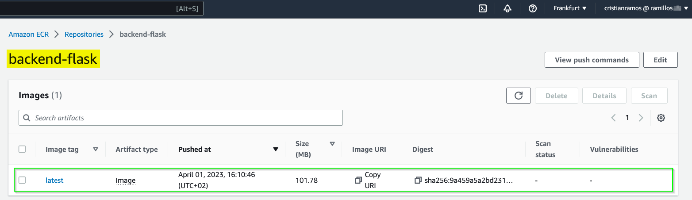
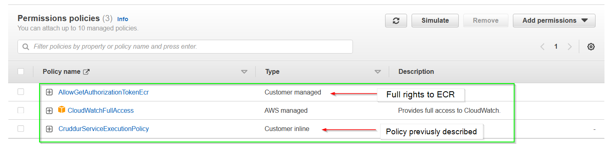

# Week 6 — Deploying Containers
## Mandatory tasks
### Watched Ashish's Week 6 - Amazon ECS Security Best Practices
:white_check_mark: DONE.
### Watched ECS Fargate (Part 1)
:white_check_mark: DONE.
### Forecast cost of Fargate
:white_check_mark: DONE.
In we worst case if we have 2 containers running every day for the whole month the cost will be arround 20USD. This forecast has been done with AWS calculator and using the parameters below:

```
- Region: Europe (Frankfurt)
- OS: Linux
- CPU Architecture: x86
- Number of tasks: 2 per month
- Average duration: 730 hours (1 month)
- Amount of vCPU allocated: 0.25 vCPU
- Amount of memory allocated: 0.5 GB
- Amount of ephemeral storage allocated for Amazon ECS: 20 GB
```

Log output:

<p align="center"></p>

### Creating healthchecks
:white_check_mark: DONE.
#### Healthcheck RDS connection
Script to test the connection to AWS RDS DB, this script will be named as `test` and will be placed in `backend-flask/bin/db/`

```py
#!/usr/bin/env python3

import psycopg
import os
import sys

connection_url = os.getenv("CONNECTION_URL")

conn = None
try:
  print('attempting connection')
  conn = psycopg.connect(connection_url)
  print("Connection successful!")
except psycopg.Error as e:
  print("Unable to connect to the database:", e)
finally:
  conn.close()
```

Then fix the permissions:

```bash
gitpod /workspace/aws-bootcamp-cruddur-2023/backend-flask (main) $ chmod u+x bin/db/test 
gitpod /workspace/aws-bootcamp-cruddur-2023/backend-flask (main) $ ls -la bin/db/test 
-rwxr--r-- 1 gitpod gitpod 331 Apr  1 09:31 bin/db/test
```

Execute python `test` to test if RDS DB is alive and conection stablished, `./bin/db/test`:

<p align="center"></p>

#### Healthcheck endpoint for Flask
1. In `backend-flask\app.py` we need to add a new endpoint with the route `/api/health-check` and returns 200 message as success.

```py
# Flask healthcheck
@app.route('/api/health-check')
def health_check():
  return {'success': True}, 200
```

2. Then we need to create a python scritp at `bin/flask/health-check` with the code below:

```py
#!/usr/bin/env python3

import urllib.request

try:
  response = urllib.request.urlopen('http://localhost:4567/api/health-check')
  if response.getcode() == 200:
    print("[OK] Flask server is running")
    exit(0) #succed message
  else:
    print("[BAD] Flask server is not running")
    exit(1) #fail message
except Exception as e:
    print("[BAD] ", e)
    exit(1) #fail message
```

3. Fix the permissions `chmod u+x bin/flask/health-check` and run the script (first try not succeded becuase local postgres DB was not running):

<p align="center"></p>

4. Create new logs groups in AWS with the follwing commands:

```bash
aws logs create-log-group --log-group-name "cruddur-fargate-cluster"
aws logs put-retention-policy --log-group-name "cruddur-fargate-cluster" --retention-in-days 1
```

<b>Note:</b> The information will be retained 1 day only, then it will be removed by the system itself.

<p align="center"></p>

### Provision ECS Cluster
:white_check_mark: DONE.
To create the ECS cluster from AWS CLI we have to run the following command:

```bash
aws ecs create-cluster \
--cluster-name cruddur \
--service-connect-defaults namespace=cruddur
```

In the picture below is shown the ECS cluster created from previous command (it is empty, so no services attached):

<p align="center"></p>

### Create ECR repo and push image for backend-flask
:white_check_mark: DONE.
#### Storing ours containers on ECR
We are going to store ours containers as private and it will be done from Gitpod console.

There is going to be 3 repos:
- Base-image python.
- Flask.
- React.

##### 1. Create `cruddur-python` repo as mutable from Gitpod CLI:

```bash
aws ecr create-repository \
  --repository-name cruddur-python \
  --image-tag-mutability MUTABLE
```

- Created repo seen from AWS console:

<p align="center"></p>

- Get logged in AWS ECR from gitpod CLI:

```bash
aws ecr get-login-password --region $AWS_DEFAULT_REGION | docker login --username AWS --password-stdin "$AWS_ACCOUNT_ID.dkr.ecr.$AWS_DEFAULT_REGION.amazonaws.com"
```

Execution log:

<p align="center"></p>

- Set the repo URL with the command below and confirm that this information matched with the one in AWS console:

```bash
export ECR_PYTHON_URL="$AWS_ACCOUNT_ID.dkr.ecr.$AWS_DEFAULT_REGION.amazonaws.com/cruddur-python"
echo $ECR_PYTHON_URL
```

Execution logs:

<p align="center"></p>

- Pull, tag and push docker image in our AWS repo:

```bash
docker pull python:3.10-slim-buster
docker tag python:3.10-slim-buster $ECR_PYTHON_URL:3.10-slim-buster
docker push $ECR_PYTHON_URL:3.10-slim-buster
```
Logs from CLI:

<p align="center"></p>

Logs AWS console:

<p align="center"></p>

After running the db and backend service, we see the flask healthcheck is workig:

<p align="center"></p>

##### 2. Create `bakend-flask` repo as mutable from Gitpod CLI:

```bash
#Create repo
aws ecr create-repository \
  --repository-name backend-flask \
  --image-tag-mutability MUTABLE
  
#Create connection URL
export ECR_BACKEND_FLASK_URL="$AWS_ACCOUNT_ID.dkr.ecr.$AWS_DEFAULT_REGION.amazonaws.com/backend-flask"
echo $ECR_BACKEND_FLASK_URL
```
Log from AWS console:

<p align="center"></p>

Log from gitpod CLI:

<p align="center"></p>

- Build, tag and push docker image in our AWS repo:

```bash
cd /workspace/aws-bootcamp-cruddur-2023/backend-flask
docker build -t backend-flask .
docker tag backend-flask:latest $ECR_BACKEND_FLASK_URL:latest
docker push $ECR_BACKEND_FLASK_URL:latest
```
Logs from gitpod cli:

<p align="center"></p>

Image seen from AWS repo:

<p align="center"></p>

### Deploy Backend Flask app as a service to Fargate
:white_check_mark: DONE.
To deploy backend flask app in Fargate, it is necessary to follow the next steps:
#### Implement parameters
1. Load enviroment variables to AWS Application Management paramater store

```bash
aws ssm put-parameter --type "SecureString" --name "/cruddur/backend-flask/AWS_ACCESS_KEY_ID" --value $AWS_ACCESS_KEY_ID
aws ssm put-parameter --type "SecureString" --name "/cruddur/backend-flask/AWS_SECRET_ACCESS_KEY" --value $AWS_SECRET_ACCESS_KEY
aws ssm put-parameter --type "SecureString" --name "/cruddur/backend-flask/CONNECTION_URL" --value $PROD_CONNECTION_URL
aws ssm put-parameter --type "SecureString" --name "/cruddur/backend-flask/ROLLBAR_ACCESS_TOKEN" --value $ROLLBAR_ACCESS_TOKEN
aws ssm put-parameter --type "SecureString" --name "/cruddur/backend-flask/OTEL_EXPORTER_OTLP_HEADERS" --value "x-honeycomb-team=$HONEYCOMB_API_KEY"
```

<p align="center"></p>

2. From AWS console go to -> AWS Systems Manager -> Application Management -> Parameter Store to see the loaded parameters:

<p align="center"></p>

#### Implement AWS service policy
AIM roles are needed for Fargate task definition, we need to do:
- create a new `role` in AIM service called `CruddurServiceExecutionRole` with the json configuration in this file :point_right: [aws/policies/service-assume-role-execution-policy.json]() --->FIX!!
- create a new `policy` in AIM service called `CruddurServiceExecutionPolicy` with the json configuration and this policy is assigned to the role previously created. :point_right: [aws/policies/service-execution-policy.json]() --->FIX!!

The execution was done with AWS CLI with the command below:

```bash

#Creating the role
aws iam create-role \
--role-name CruddurServiceExecutionRole  \
--assume-role-policy-document file://aws/policies/service-assume-role-execution-policy.json

#Creating the policy and putting the assiidination to the role previously created
aws iam put-role-policy \
--role-name CruddurServiceExecutionRole \
--policy-name CruddurServiceExecutionPolicy \
--policy-document file://aws/policies/service-execution-policy.json
```

<p align="center"></p>

#### Creating Task role
To Create the task role `CruddurTaskRole` and `SSMAccessPolicy` policy and make their association, I ran the commands below:

```bash
#Creating role CruddurTaskRole
aws iam create-role \
    --role-name CruddurTaskRole \
    --assume-role-policy-document "{
  \"Version\":\"2012-10-17\",
  \"Statement\":[{
    \"Action\":[\"sts:AssumeRole\"],
    \"Effect\":\"Allow\",
    \"Principal\":{
      \"Service\":[\"ecs-tasks.amazonaws.com\"]
    }
  }]
}"

#Attaching SSMAccessPolicy policy to CruddurTaskRole
aws iam put-role-policy \
  --policy-name SSMAccessPolicy \
  --role-name CruddurTaskRole \
  --policy-document "{
  \"Version\":\"2012-10-17\",
  \"Statement\":[{
    \"Action\":[
      \"ssmmessages:CreateControlChannel\",
      \"ssmmessages:CreateDataChannel\",
      \"ssmmessages:OpenControlChannel\",
      \"ssmmessages:OpenDataChannel\"
    ],
    \"Effect\":\"Allow\",
    \"Resource\":\"*\"
  }]
}
"
#Attaching CloudWatchFullAccess policy to CruddurTaskRole
aws iam attach-role-policy --policy-arn arn:aws:iam::aws:policy/CloudWatchFullAccess --role-name CruddurTaskRole

#Attaching AWSXRayDaemonWriteAccess policy to CruddurTaskRole
aws iam attach-role-policy --policy-arn arn:aws:iam::aws:policy/AWSXRayDaemonWriteAccess --role-name CruddurTaskRole
```

<p align="center"></p>

#### Creating Task definition
From AWS console go to ECS service -> task definitions
<b>Note:</b> task definitions is `similar to docker-`compose file where we define how the containers will run. [LINK](https://docs.docker.com/cloud/ecs-integration/)

In our case will have we have the json file with the information needed to make the implementation: [Link to backend-flas.json]()

With the command below the task is defined:
```bash
aws ecs register-task-definition --cli-input-json file://aws/task-definitions/backend-flask.json
```

<p align="center"></p>

#### Creating Security Group

```bash
#Creating env variable to get the VPC ID
export DEFAULT_VPC_ID=$(aws ec2 describe-vpcs \
--filters "Name=isDefault, Values=true" \
--query "Vpcs[0].VpcId" \
--output text)
#Printing the information received
echo $DEFAULT_VPC_ID

#Creating security group called crud-srv-sg under default VPC 
export CRUD_SERVICE_SG=$(aws ec2 create-security-group \
  --group-name "crud-srv-sg" \
  --description "Security group for Cruddur services on ECS" \
  --vpc-id $DEFAULT_VPC_ID \
  --query "GroupId" --output text)
echo $CRUD_SERVICE_SG

#Authorising port 80 in security group "crud-srv-sg"
aws ec2 authorize-security-group-ingress \
  --group-id $CRUD_SERVICE_SG \
  --protocol tcp \
  --port 80 \
  --cidr 0.0.0.0/0
```

<p align="center"></p>

#### Deploy Backend Flask app from AWS console

From AWS console go to ECS service -> cruddur cluster -> services --> create service:
<b>Note:</b> we will use service because at the end when the container is stoped, it will be killed if we implment it as a task. For that reason we will use it as a service. 

Make sure that role `CruddurServiceExecutionRole` has the following policies applied:

<p align="center"></p>

```json
#AllowGetAuthorizationTokenEcr
{
    "Version": "2012-10-17",
    "Statement": [
        {
            "Sid": "VisualEditor0",
            "Effect": "Allow",
            "Action": [
                "ecr:GetAuthorizationToken",
                "ecr:BatchCheckLayerAvailability",
                "ecr:GetDownloadUrlForLayer",
                "ecr:BatchGetImage",
                "logs:CreateLogStream",
                "logs:PutLogEvents"
            ],
            "Resource": "*"
        }
    ]
}
```

EC2 instance deployed:

<p align="center"></p>

#### Deploy Backend Flask app from AWS CLI
To deploy the backend-flask container as a service via AWS CLI, we will need the json file `service-backend-flask.json` with the updated information of sg and subs. [service-backend-flask.json]() -->FIX!!

Command to create the service:

```bash
#Get subnet info
export DEFAULT_SUBNET_IDS=$(aws ec2 describe-subnets  \
 --filters Name=vpc-id,Values=$DEFAULT_VPC_ID \
 --query 'Subnets[*].SubnetId' \
 --output json | jq -r 'join(",")')
echo $DEFAULT_SUBNET_IDS

#Deploy backend-flask container
aws ecs create-service --cli-input-json file://aws/json/service-backend-flask.json
```
Log from AWS console:

<p align="center"></p>

- Getting logged inside of container console:

```bash
#Installing session manager
curl "https://s3.amazonaws.com/session-manager-downloads/plugin/latest/ubuntu_64bit/session-manager-plugin.deb" -o "session-manager-plugin.deb"
sudo dpkg -i session-manager-plugin.deb
session-manager-plugin #Very that it is working

#Getting logged in EC2 instance
aws ecs execute-command  \
    --region $AWS_DEFAULT_REGION \
    --cluster cruddur \
    --task <<TASK_ID>> \
    --container backend-flask \
    --command "/bin/bash" \
    --interactive
```
<p align="center"></p>

- This loging has been scripted under in [backend-flas/bin/fargate/connect-to-service](), with this script we makes easier the access to container for debuging. -->FIX!!
- Accessing from internet to EC2 instance:

<p align="center"></p>
